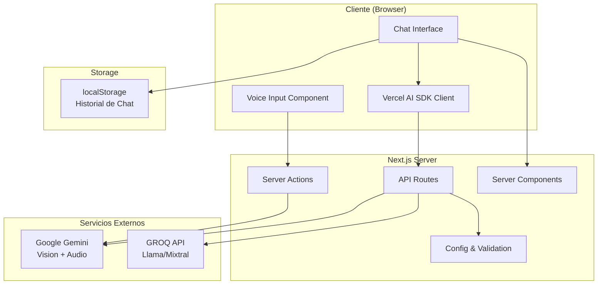
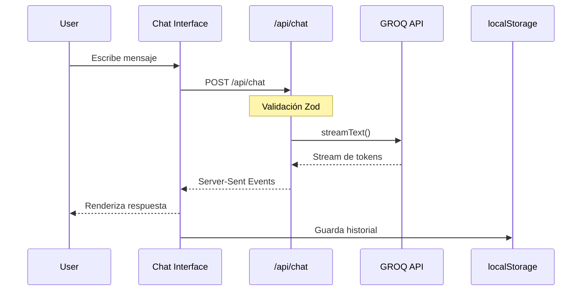
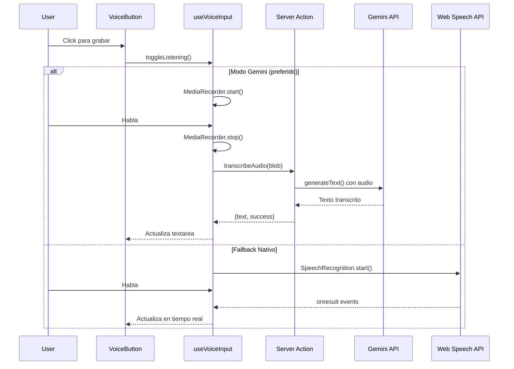
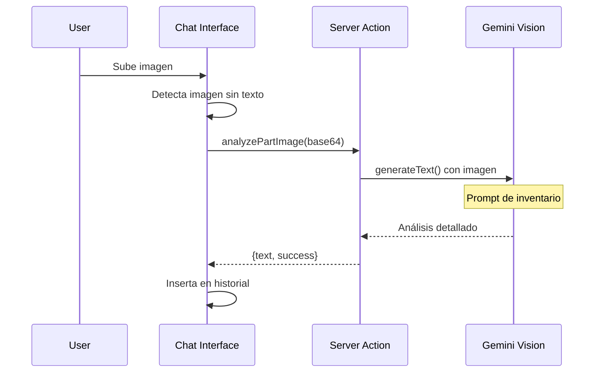

# Arquitectura del Sistema - GIMA AI Chatbot

Este documento describe la arquitectura técnica del chatbot de mantenimiento GIMA.

## 🏗️ Visión General

El sistema está construido con Next.js 16 (App Router) y utiliza una arquitectura moderna basada en Server Components y Server Actions.



## 📂 Estructura del Proyecto

```
gima-ai-chatbot/
├── app/                          # Next.js App Router
│   ├── api/                      # API Routes
│   │   └── chat/
│   │       └── route.ts          # Endpoint principal de chat
│   ├── components/               # Componentes React
│   │   ├── ui/                   # UI Components base
│   │   │   ├── chat-interface.tsx    # Interfaz principal
│   │   │   ├── voice-button.tsx      # Botón de voz
│   │   │   └── ...               # 20+ componentes UI reutilizables
│   │   └── ai-elements/          # Componentes específicos de AI
│   │       ├── conversation.tsx
│   │       ├── message.tsx
│   │       └── prompt-input.tsx
│   ├── hooks/                    # Custom React Hooks
│   │   ├── usePersistentChat.ts  # Persistencia + useChat wrapper
│   │   └── useVoiceInput.ts      # Reconocimiento de voz híbrido
│   ├── types/                    # TypeScript Types
│   │   └── chat.types.ts         # Tipos compartidos para chat
│   ├── config/                   # Configuración
│   │   ├── env.ts                # Validación de env vars (Zod)
│   │   └── index.ts              # Constants (prompts, modelos)
│   ├── actions.ts                # Server Actions (transcripción, visión)
│   ├── layout.tsx                # Layout raíz
│   └── page.tsx                  # Página principal
├── docs/                         # Documentación
│   ├── ARCHITECTURE.md           # Este archivo
│   ├── API.md                    # Documentación de API
│   ├── DEPLOYMENT.md             # Guía de despliegue
│   ├── CONTRIBUTING.md           # Guía de contribución
│   └── NOTES.md                  # Plan de profesionalización
├── .husky/                       # Git Hooks
│   ├── pre-commit                # lint-staged
│   ├── commit-msg                # commitlint
│   └── pre-push                  # type-check
└── public/                       # Assets estáticos
```

## 🔄 Flujo de Datos

### 1. Flujo de Chat Básico



### 2. Flujo de Entrada de Voz



### 3. Flujo de Análisis de Imagen



## 🧩 Componentes Principales

### 1. Chat Interface (`chat-interface.tsx`)

**Responsabilidades:**

- Renderiza la conversación completa
- Maneja entrada de texto, voz e imágenes
- Integra `useChat` de Vercel AI SDK
- Persiste historial en localStorage

**Hooks utilizados:**

- `usePersistentChat`: Wrapper de `useChat` con persistencia
- `useVoiceInput`: Manejo de entrada de voz híbrida

### 2. useVoiceInput Hook

**Modos de operación:**

```typescript
type VoiceMode = 'gemini' | 'native';
```

**Estrategia de fallback:**

1. **Primero**: Intenta Gemini (MediaRecorder + Server Action)
   - Mayor precisión
   - Funciona offline después de la primera carga
2. **Fallback**: Web Speech API (nativa del navegador)
   - Soporte en Chrome/Edge
   - Resultados en tiempo real

### 3. Server Actions (`actions.ts`)

#### `transcribeAudio()`

- Modelo: `gemini-2.5-flash-lite`
- Post-procesamiento: Elimina timestamps automáticos
- Error handling: Tipos seguros (`unknown` → `Error`)

#### `analyzePartImage()`

- Modelo: `gemini-2.5-flash`
- Prompt especializado para inventario industrial
- Soporta: JPEG, PNG, WebP, GIF

### 4. API Route (`/api/chat`)

**Stack:**

- **Proveedor**: GROQ (Llama, Mixtral)
- **SDK**: Vercel AI SDK v5
- **Validación**: Zod schemas
- **Streaming**: Server-Sent Events (SSE)

**Seguridad:**

- Validación de env vars con Zod
- Validación de request body
- Headers de seguridad (CSP, X-Frame-Options)
- Type checking estricto

## 🔐 Gestión de Estado

### Cliente (React)

| Estado              | Ubicación                   | Persistencia          |
| ------------------- | --------------------------- | --------------------- |
| Mensajes del chat   | `usePersistentChat`         | localStorage          |
| Estado de voz       | `useVoiceInput`             | Memoria (no persiste) |
| Modelo seleccionado | `useState` en ChatInterface | Memoria               |

### Servidor

| Configuración       | Fuente                | Validación                 |
| ------------------- | --------------------- | -------------------------- |
| API Keys            | Variables de entorno  | Zod en `app/config/env.ts` |
| Prompts del sistema | `app/config/index.ts` | TypeScript                 |
| Headers HTTP        | `next.config.ts`      | Next.js                    |

## 🛡️ Seguridad

### Validación de Entrada

```typescript
// Todas las entradas externas pasan por Zod
const requestSchema = z.object({
  messages: z.array(messageSchema),
  model: z.string().optional(),
});
```

### Variables de Entorno

```typescript
// Fail-fast en startup si faltan keys
export const env = envSchema.parse(process.env);
```

### Headers HTTP

- `X-Content-Type-Options: nosniff`
- `X-Frame-Options: DENY`
- `X-XSS-Protection: 1; mode=block`
- `Referrer-Policy: strict-origin-when-cross-origin`

## 📊 Métricas y Límites

| Métrica             | Valor                      | Configurable en       |
| ------------------- | -------------------------- | --------------------- |
| Body size máximo    | 3MB                        | `next.config.ts`      |
| Modelos disponibles | 3 (Llama, Mixtral, Gemini) | `app/config/index.ts` |
| Storage local       | ~10MB típico               | Límite del navegador  |
| Streaming timeout   | Default Next.js            | -                     |

## 🚀 Tecnologías Clave

| Tecnología    | Versión | Uso                  |
| ------------- | ------- | -------------------- |
| Next.js       | 16.0.10 | Framework            |
| React         | 19.2.1  | UI Library           |
| TypeScript    | 5.x     | Type Safety          |
| Vercel AI SDK | 5.0.115 | Integración con LLMs |
| Zod           | 4.2.1   | Validación runtime   |
| Radix UI      | Latest  | Componentes base     |
| Tailwind CSS  | 4.x     | Estilos              |

## 🔄 Próximas Evoluciones

### Fase 4: Optimización

- Lazy loading de componentes pesados
- Bundle analysis
- Debounced localStorage saves

### Fase 5: Escalabilidad

- Migración a Supabase (PostgreSQL)
- Múltiples conversaciones
- Rate limiting con Upstash Redis
