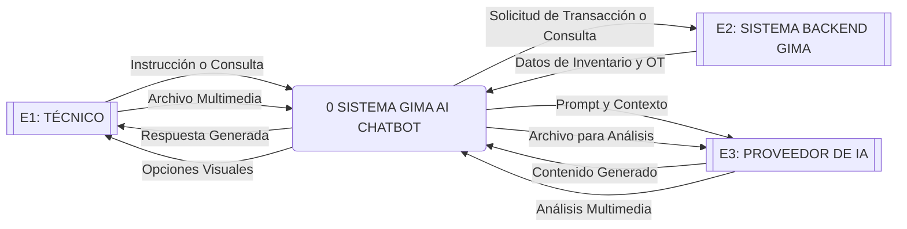
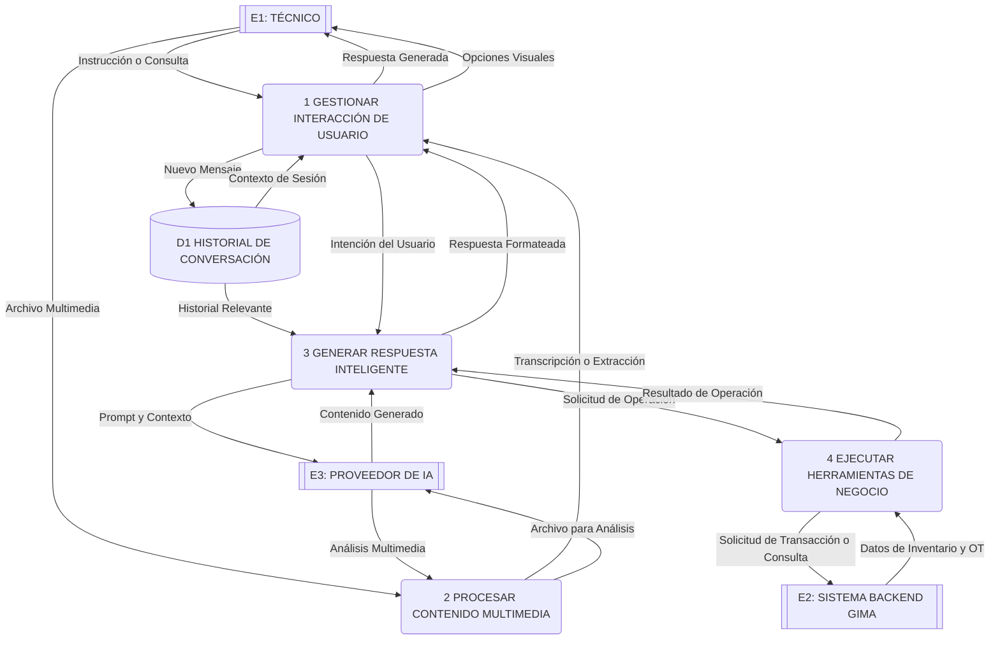
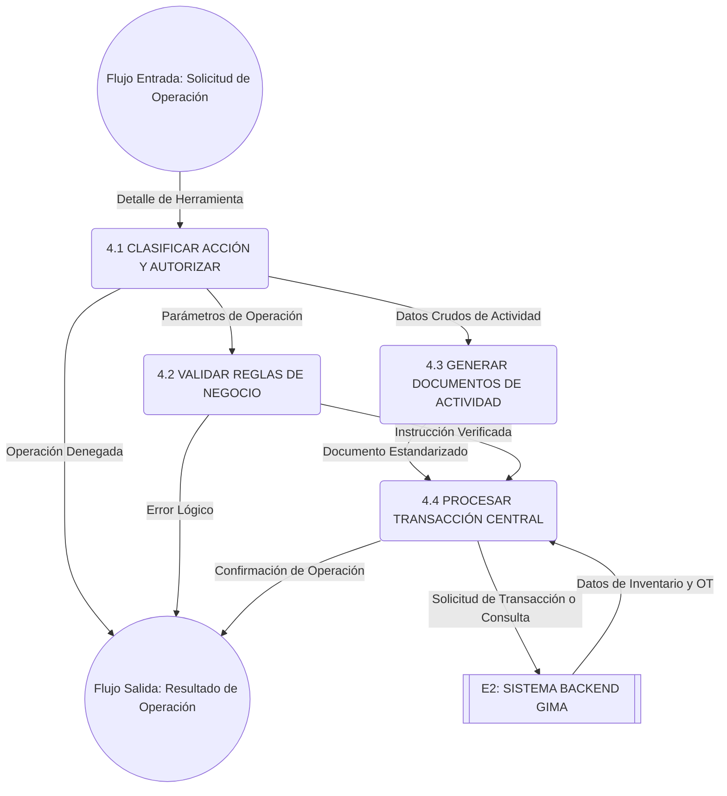

# Data Flow Diagrams (DFDs) - GIMA AI Chatbot

A continuación, se presentan los Diagramas de Flujo de Datos (DFD) **Lógicos** para el sistema **GIMA AI Chatbot**. Siguiendo la metodología de análisis estructurado puro (Kendall & Kendall / general), este documento se centra en el **QUÉ** hace el sistema (flujos de información y procesos de negocio) en lugar de en el **CÓMO** (tecnologías, manejo de JSON, detalles de framework, interceptores o mapeo estricto de tipos).

---

## DFD Nivel 0 (Nivel de Contexto)

El nivel de contexto ilustra el sistema GIMA AI Chatbot en su totalidad y su interacción con las entidades externas.

### Tabla de Elementos (Nivel 0)

| ID  | Tipo            | Nombre                      | Descripción                                                                 |
| --- | --------------- | --------------------------- | --------------------------------------------------------------------------- |
| E1  | Entidad Externa | **TÉCNICO**                 | Usuario en campo o taller que requiere asistencia interactiva.              |
| E2  | Entidad Externa | **SISTEMA BACKEND GIMA**    | Sistema central para control de inventario y Órdenes de Trabajo (OT).       |
| E3  | Entidad Externa | **PROVEEDOR DE IA**         | Servicios cognitivos externos (Generación de texto, Visión, Transcripción). |
| P0  | Proceso         | **SISTEMA GIMA AI CHATBOT** | La plataforma inteligente de mediación, proceso y control conversacional.   |

### Diagrama Mermaid (Nivel 0)

---

## DFD Nivel 1 (Subsistemas Principales)

Se desglosa el proceso principal P0 en los cuatro grandes módulos lógicos del chatbot.

### Tabla de Elementos (Nivel 1)

| ID  | Tipo    | Nombre                               | Descripción                                                                              |
| --- | ------- | ------------------------------------ | ---------------------------------------------------------------------------------------- |
| P1  | Proceso | **GESTIONAR INTERACCIÓN DE USUARIO** | Recepción de inputs, administración de la vista y visualización de progreso.             |
| P2  | Proceso | **PROCESAR CONTENIDO MULTIMEDIA**    | Transformación de voz y documentos en texto o datos útiles para el contexto.             |
| P3  | Proceso | **GENERAR RESPUESTA INTELIGENTE**    | Core lógico; evalúa el contexto y pide a la IA la respuesta o deducción de herramientas. |
| P4  | Proceso | **EJECUTAR HERRAMIENTAS DE NEGOCIO** | Aplicación directa de las reglas de operación sobre el sistema central.                  |
| D1  | Almacén | **D1 HISTORIAL DE CONVERSACIÓN**     | Memoria temporal del hilo de discusión y tareas en progreso.                             |

### Diagrama Mermaid (Nivel 1)

---

## DFD Nivel 2 (Desglose del Proceso 4.0: Ejecutar Herramientas de Negocio)

Se ilustra cómo, de manera lógica, el sistema valida y lleva a cabo la instrucción sugerida por la IA sin adentrarse en detalles de implementación.

### Tabla de Elementos (Nivel 2)

| ID   | Tipo    | Nombre                              | Descripción                                                                                       |
| ---- | ------- | ----------------------------------- | ------------------------------------------------------------------------------------------------- |
| P4.1 | Proceso | **CLASIFICAR ACCIÓN Y AUTORIZAR**   | Decisión primaria: comprueba qué regla de negocio aplica y si es permitida.                       |
| P4.2 | Proceso | **VALIDAR REGLAS DE NEGOCIO**       | Inspecciona lógicamente que los argumentos pasados a la herramienta sean correctos y congruentes. |
| P4.3 | Proceso | **GENERAR DOCUMENTOS DE ACTIVIDAD** | Si procede, agrupa el trabajo en formatos preestablecidos (resúmenes, checklists).                |
| P4.4 | Proceso | **PROCESAR TRANSACCIÓN CENTRAL**    | Ejecuta la consulta o modificación final en el repositorio principal del negocio.                 |

### Diagrama Mermaid (Nivel 2)

> **Aclaración sobre Niveles Físicos Adicionales:**
> En la versión anterior de este diagrama se incluían los "Niveles 3 y 4" que abordaban temas como **Mapeo de DTOs, Fetch Interceptors, Tokens de Autenticación, Paginación JSON y Transformación de Fechas UTC**.
>
> De acuerdo con las mejores prácticas del diseño estructurado (DFD Lógico), todos esos elementos son **detalles de implementación física** que describen _cómo_ se programa y no _qué_ flujo de información requiere el negocio. Por lo tanto, fueron eliminados intencionalmente de este documento enfocado en el análisis lógico puro.
