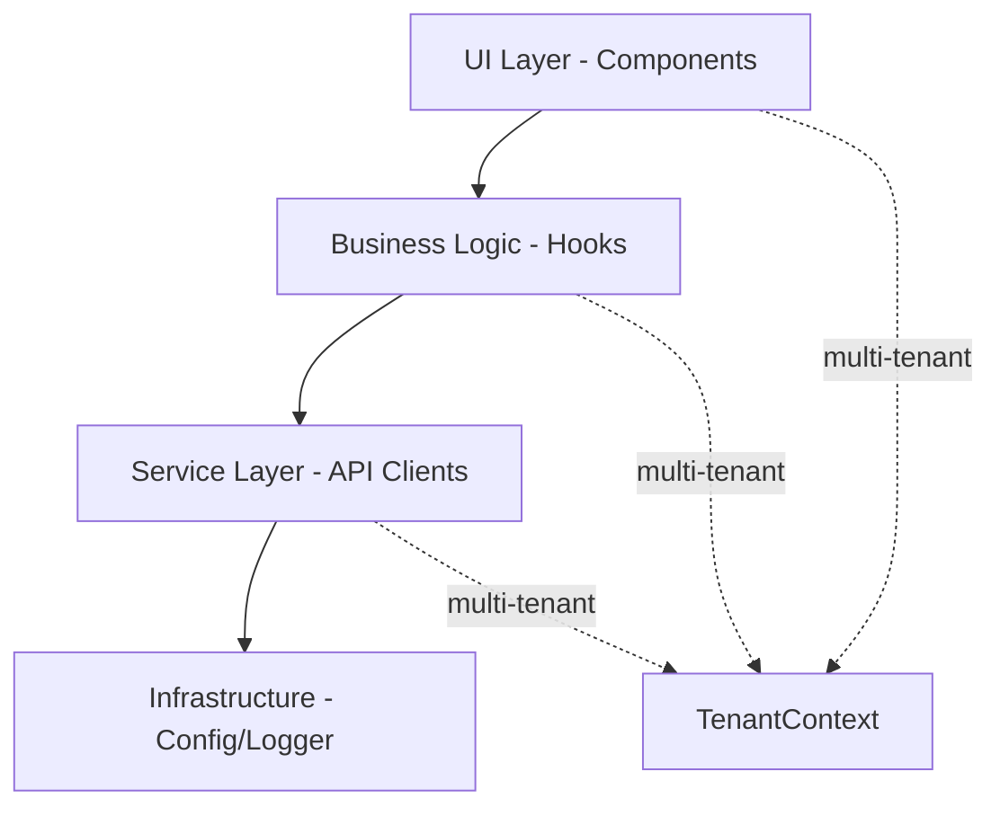

# ENGINEERING_MANUAL.md V5 - Proyecto GIMA

> **Versión:** 5.0 (Híbrida)  
> **Propósito:** Manual de ingeniería que combina las mejores prácticas de arquitectura SaaS, testing robusto, y simplicidad de implementación.  
> **Base:** V2 (SaaS) + V4 (Testing) + V1 (Simplicidad) + V3 (Claridad)

---

## 📋 Tabla de Contenidos

1. [Filosofía y Principios](#filosofía-y-principios)
2. [Arquitectura de Componentes](#arquitectura-de-componentes)
3. [Service Layer](#service-layer)
4. [Gestión de Estado y Side Effects](#gestión-de-estado-y-side-effects)
5. [Observabilidad y Logging](#observabilidad-y-logging)
6. [Internacionalización (i18n)](#internacionalización-i18n)
7. [Accesibilidad (WCAG 2.1 AA)](#accesibilidad-wcag-21-aa)
8. [Performance y Optimización](#performance-y-optimización)
9. [Testing](#testing)
10. [Configuración y Feature Flags](#configuración-y-feature-flags)
11. [Plantillas y Herramientas](#plantillas-y-herramientas)
12. [Criterios de Calidad](#criterios-de-calidad)

---

## 🎯 Filosofía y Principios

### Principios Rectores

1. **Documentar lo que funciona, no reinventar** - Sistematizar patrones existentes
2. **Hacer obvio lo correcto** - La arquitectura debe guiar, no imponer
3. **Prevenir problemas futuros** - Diseñar para escalar
4. **Simplicidad primero** - No crear abstracciones antes de necesitarlas

### Reglas Fundamentales

- ✅ Componentes pequeños (máx. 200 líneas)
- ✅ Complejidad ciclomática < 10
- ✅ Tipado estricto (evitar `any`)
- ✅ Separación clara: UI ↔ Hooks ↔ Service Layer
- ✅ Contexto multi-tenant obligatorio (SaaS)

---

## 🏗️ Arquitectura de Componentes

### Estructura Feature-Based (Obligatoria)

**Convención de Nombres:** El componente principal usa el nombre del feature, los subcomponentes usan ese nombre como prefijo.

```
app/components/features/[feature]/
├── [feature].tsx         # Componente principal (<150 líneas)
├── [feature]-header.tsx  # Subcomponentes con prefijo del feature
├── [feature]-list.tsx
├── [feature]-item.tsx
├── hooks/                # Lógica de negocio encapsulada
│   ├── use-feature-data.ts
│   ├── use-feature-actions.ts
│   └── index.ts
├── services/             # (Opcional) Service layer específico
│   └── feature-service.ts
├── constants.ts          # Configuración del feature
├── types.ts              # Interfaces TypeScript (NO any)
├── utils.ts              # Funciones puras (helpers)
└── index.ts              # Export público del feature
```

**Ejemplo Concreto:**

```
app/components/features/chat/
├── chat.tsx              # Componente principal orquestador
├── chat-header.tsx       # Subcomponente: header con acciones
├── chat-message.tsx      # Subcomponente: mensaje individual
├── chat-input.tsx        # Subcomponente: área de input
├── chat-status-bar.tsx   # Subcomponente: indicadores de estado
├── hooks/
│   ├── use-chat-data.ts
│   ├── use-chat-actions.ts
│   └── index.ts
├── constants.ts
├── types.ts
├── utils.ts
└── index.ts              # export { Chat } from './chat';
```

**Por qué esta estructura:**

- ✅ Sin anidamiento innecesario (evita `app/components/features/chat/components/...`)
- ✅ Autocomplete del IDE agrupa componentes relacionados por prefijo
- ✅ Claro cuál es el componente principal vs subcomponentes
- ✅ Usado por equipos grandes (Vercel, Shopify, Airbnb)

### Reglas de Importación Estrictas

```typescript
// ✅ PERMITIDO: Features → Shared/UI
import { Button } from '@/app/components/ui/button';
import { Container } from '@/app/components/shared/layout';

// ❌ PROHIBIDO: Features → Features (causa acoplamiento)
import { SettingsPanel } from '@/app/components/features/settings';

// ✅ SOLUCIÓN: Usar estado global o eventos
import { useGlobalSettings } from '@/app/store/settings';
```

### Convención de Nomenclatura de Archivos

**Regla Fundamental:** Todos los nombres de archivos y directorios deben usar **`kebab-case`** (minúsculas con guiones).

#### Por qué `kebab-case`:

1. **Seguridad en Git/Linux:**
   - Windows/macOS son _case-insensitive_ (`Chat.tsx` = `chat.tsx`)
   - Linux (servidores Vercel/AWS) es _case-sensitive_
   - Cambiar `chat.tsx` → `Chat.tsx` puede causar que Git no detecte el cambio
   - **Resultado:** Funciona localmente pero crashea en producción
   - **Solución:** Minúsculas siempre = elimina esta clase de bugs

2. **Consistencia con Next.js App Router:**
   - Rutas en Next.js 13+ son carpetas en minúsculas (`app/dashboard/page.tsx`)
   - Componentes Shadcn/ui usan `kebab-case` (`components/ui/button.tsx`)
   - Mantener `kebab-case` en todo el proyecto = consistencia total

3. **Estándar de ecosistema moderno:**
   - Usado por: Vercel (Next.js oficial), Shadcn/ui, v0.dev
   - Tendencia dominante en startups 2024+

#### Aplicación por Tipo de Archivo:

```typescript
// ✅ COMPONENTES
components/features/chat/
├── chat.tsx              // Componente principal
├── chat-header.tsx       // Subcomponente
├── chat-message.tsx      // Subcomponente
└── chat-input.tsx

// ✅ HOOKS
hooks/
├── use-chat-data.ts      // Hook de datos
├── use-chat-actions.ts   // Hook de acciones
└── use-voice-input.ts

// ✅ SERVICES Y UTILIDADES
lib/
├── chat-service.ts       // Clase de servicio
├── chat-utils.ts         // Funciones utilitarias
└── logger.ts

// ✅ ARCHIVOS DE CONFIGURACIÓN
├── constants.ts
├── types.ts
└── utils.ts
```

#### Nombres Dentro del Código (Exportaciones):

Aunque los archivos usan `kebab-case`, el código dentro sigue convenciones JavaScript/TypeScript:

```typescript
// Archivo: components/chat/chat-header.tsx
// ✅ Componente exportado: PascalCase
export function ChatHeader() { ... }

// Archivo: hooks/use-chat-data.ts
// ✅ Hook exportado: camelCase
export function useChatData() { ... }

// ⚠️ IMPORTANTE: React EXIGE que los hooks:
//    1. Empiecen con "use" (minúscula)
//    2. Sigan con PascalCase (ej: useChatData, no use_chat_data)
//    Esto permite que el linter de React valide las reglas de hooks


// Archivo: lib/chat-service.ts
// ✅ Clase: PascalCase
export class ChatService { ... }

// ✅ Función: camelCase
export function formatMessage() { ... }

// Archivo: types.ts
// ✅ Interface/Type: PascalCase
export interface Message { ... }
export type ChatStatus = 'ready' | 'streaming';
```

#### Ejemplos Completos:

```
✅ CORRECTO:
app/components/features/chat/
├── chat.tsx                    → export function Chat()
├── chat-header.tsx             → export function ChatHeader()
├── use-chat-submit.ts          → export function useChatSubmit()
├── chat-service.ts             → export class ChatService
└── constants.ts                → export const CHAT_CONFIG

❌ INCORRECTO:
app/components/features/chat/
├── Chat.tsx                    → ❌ PascalCase en archivo
├── ChatHeader.tsx              → ❌ PascalCase en archivo
├── useChatSubmit.ts            → ❌ camelCase en archivo
└── ChatService.ts              → ❌ PascalCase en archivo
```

**Resumen de Reglas:**

- 📁 **Archivos y carpetas:** `kebab-case` (siempre minúsculas)
- 🎨 **Componentes React:** PascalCase en código (`export function ChatHeader`)
- 🪝 **Hooks:** camelCase en código con prefijo `use` (`export function useChatData`) - **Obligatorio por React**
- 🔧 **Clases:** PascalCase en código (`export class ChatService`)
- 📦 **Funciones:** camelCase en código (`export function formatMessage`)
- 📋 **Tipos/Interfaces:** PascalCase en código (`interface Message`)

### Arquitectura en Capas (SaaS)



**Contexto Multi-Tenant Obligatorio:**

```typescript
// ❌ PROHIBIDO: Componentes sin contexto SaaS
function ChatComponent() {
  // Sin tenantId - NO PERMITIDO
}

// ✅ OBLIGATORIO: Todo componente SaaS debe recibir contexto
interface ChatComponentProps {
  tenantId: string;
  workspaceId?: string;
  billingPlan: 'free' | 'pro' | 'enterprise';
}

function ChatComponent({ tenantId, billingPlan }: ChatComponentProps) {
  // Lógica con contexto de tenant
}
```

### ⚠️ Importante: Cuándo Aplicar Multi-Tenant Context

No todos los endpoints API requieren contexto multi-tenant. La distinción es crítica:

#### ✅ APIs Internas (REQUIEREN contexto multi-tenant)

APIs que **gestionan recursos del sistema** propios de la aplicación:

```typescript
// Ejemplos de APIs internas que SÍ requieren contexto
// app/api/workspaces/route.ts
// app/api/users/route.ts
// app/api/billing/route.ts
// app/api/settings/route.ts
// app/api/documents/route.ts

export async function GET(req: Request) {
  // ✅ OBLIGATORIO: Extraer y validar tenant
  const tenantId = await extractTenantId(req);
  const billingPlan = await getBillingPlan(tenantId);

  // Validar permisos según plan
  if (billingPlan === 'free' && exceedsLimit()) {
    return NextResponse.json({ error: 'Upgrade required', requiredPlan: 'pro' }, { status: 402 });
  }

  // Queries filtradas por tenant
  const data = await db.query({
    where: { tenantId }, // ← Crucial para aislamiento de datos
  });

  return NextResponse.json(data);
}
```

**Por qué es obligatorio:**

- Aislamiento de datos entre tenants
- Control de permisos y quotas por plan
- Prevención de acceso no autorizado
- Auditoría y trazabilidad

#### ❌ APIs Proxy/Gateway (NO requieren contexto multi-tenant obligatorio)

APIs que **reenvían requests** a servicios externos de terceros:

```typescript
// Ejemplos de APIs proxy que NO requieren multi-tenant obligatorio
// app/api/chat/route.ts       (proxy a GROQ/OpenAI)
// app/api/vision/route.ts     (proxy a Google Gemini)
// app/api/translate/route.ts  (proxy a Google Translate)
// app/api/email/route.ts      (proxy a SendGrid)

export async function POST(req: Request) {
  // ✅ Rate limiting por IP (suficiente para proxies simples)
  const clientIP = extractClientIP(req);

  if (!rateLimiter.checkLimit(clientIP)) {
    return NextResponse.json({ error: 'Rate limit exceeded' }, { status: 429 });
  }

  // Validar request
  const body = await req.json();

  // Proxy a servicio externo
  const response = await fetch('https://api.external-service.com/endpoint', {
    method: 'POST',
    headers: { Authorization: `Bearer ${process.env.EXTERNAL_API_KEY}` },
    body: JSON.stringify(body),
  });

  return response;
}
```

**Por qué NO es obligatorio:**

- No gestionan recursos propios del sistema
- Autenticación manejada por el servicio externo
- Rate limiting puede ser por IP/sesión
- No hay datos del tenant que aislar

#### 🔄 Caso Híbrido: Proxy con Multi-Tenancy Opcional

Si en el futuro se requiere quotas diferenciadas o tracking por usuario:

```typescript
// app/api/chat/route.ts (versión mejorada)
export async function POST(req: Request) {
  // Opcional: Extraer userId para quotas diferenciadas
  const userId = await extractUserId(req); // De sesión/JWT
  const userTier = userId ? await getUserTier(userId) : 'free';

  // Rate limit diferenciado por tier
  const limits = {
    free: 20, // 20 requests/hora
    pro: 100, // 100 requests/hora
    enterprise: 1000,
  };

  const limit = limits[userTier];

  if (!rateLimiter.checkLimit(userId || clientIP, limit)) {
    return NextResponse.json(
      {
        error: 'Rate limit exceeded',
        upgrade: userTier === 'free' ? 'Upgrade to Pro for higher limits' : null,
      },
      { status: 429 }
    );
  }

  // Resto de la lógica de proxy...
}
```

#### 📊 Tabla de Decisión Rápida

| Tipo de API              | Ejemplo                     | Multi-Tenant       | Razón                    |
| ------------------------ | --------------------------- | ------------------ | ------------------------ |
| CRUD de recursos propios | `/api/workspaces`           | ✅ **Obligatorio** | Aislamiento de datos     |
| Configuración de usuario | `/api/settings`             | ✅ **Obligatorio** | Permisos por tenant      |
| Billing/Subscriptions    | `/api/billing`              | ✅ **Obligatorio** | Modelo SaaS core         |
| Proxy a IA externa       | `/api/chat` (→ GROQ)        | ❌ Opcional        | No gestiona recursos     |
| Proxy a traducción       | `/api/translate` (→ Google) | ❌ Opcional        | Servicio stateless       |
| Webhooks externos        | `/api/webhooks/stripe`      | ⚠️ **Especial**    | Validar firma, no tenant |

---

## 🔌 Service Layer

### Patrón Base (Abstract Service)

```typescript
// app/lib/services/base-service.ts
import { env } from '@/app/config/env';
import { logger } from '@/app/lib/logger';

export abstract class BaseService {
  protected baseUrl: string;
  protected defaultHeaders: Record<string, string>;

  constructor(baseUrl?: string) {
    this.baseUrl = baseUrl || env.NEXT_PUBLIC_API_URL;
    this.defaultHeaders = {
      'Content-Type': 'application/json',
    };
  }

  protected async request<T>(endpoint: string, options: RequestInit = {}): Promise<T> {
    const url = `${this.baseUrl}${endpoint}`;
    const correlationId = crypto.randomUUID();

    logger.info('Service request', { url, method: options.method, correlationId });

    try {
      const response = await fetch(url, {
        ...options,
        headers: {
          ...this.defaultHeaders,
          ...options.headers,
          'X-Correlation-ID': correlationId,
          'X-Tenant-ID': this.getTenantId(),
        },
        signal: AbortSignal.timeout(30000), // Timeout automático
      });

      if (!response.ok) {
        await this.handleErrorResponse(response, correlationId);
      }

      const data = await response.json();
      logger.info('Service response success', { correlationId });
      return data;
    } catch (error) {
      logger.error('Service request failed', { error, correlationId });
      throw this.normalizeError(error);
    }
  }

  private async handleErrorResponse(response: Response, correlationId: string): Promise<never> {
    const errorData = await response.json().catch(() => ({}));

    // Errores SaaS críticos
    switch (response.status) {
      case 402:
        throw new Error(`Payment required - ${errorData.requiredPlan} plan needed`);
      case 403:
        throw new Error(`Forbidden - ${errorData.requiredRole} role required`);
      case 429:
        throw new Error(`Rate limit exceeded - retry after ${errorData.retryAfter}s`);
      default:
        throw new Error(`HTTP ${response.status}: ${errorData.message || 'Unknown error'}`);
    }
  }

  private getTenantId(): string {
    // Implementar según sistema de autenticación
    return typeof window !== 'undefined'
      ? localStorage.getItem('tenantId') || 'unknown'
      : 'server-context';
  }

  private normalizeError(error: unknown): Error {
    if (error instanceof Error) return error;
    if (error instanceof DOMException && error.name === 'TimeoutError') {
      return new Error('Request timeout');
    }
    return new Error('Unknown service error');
  }
}
```

### Implementación de Service Específico

```typescript
// app/lib/services/chat-service.ts
import { BaseService } from './base-service';
import type { Message, CreateMessageDto } from '@/app/types';

export class ChatService extends BaseService {
  /**
   * Envía un mensaje al chat
   * @param request - Datos del mensaje
   * @returns Mensaje creado con ID del servidor
   */
  async sendMessage(request: CreateMessageDto): Promise<Message> {
    return this.request<Message>('/api/chat/messages', {
      method: 'POST',
      body: JSON.stringify(request),
    });
  }

  async getHistory(conversationId: string): Promise<Message[]> {
    return this.request<Message[]>(`/api/chat/conversations/${conversationId}`);
  }

  async deleteMessage(messageId: string): Promise<void> {
    await this.request(`/api/chat/messages/${messageId}`, {
      method: 'DELETE',
    });
  }
}

// Singleton export
export const chatService = new ChatService();
```

---

## ⚛️ Gestión de Estado y Side Effects

### useSyncExternalStore (SSR Safe)

Para estado que depende de APIs del navegador:

```typescript
// app/hooks/useTheme.ts
import { useSyncExternalStore } from 'react';

type Theme = 'light' | 'dark';

const themeStore = {
  getSnapshot(): Theme {
    if (typeof window === 'undefined') return 'light';
    return (localStorage.getItem('theme') as Theme) || 'light';
  },

  getServerSnapshot(): Theme {
    return 'light'; // Default para SSR
  },

  subscribe(callback: () => void) {
    const handleStorage = (e: StorageEvent) => {
      if (e.key === 'theme') callback();
    };

    window.addEventListener('storage', handleStorage);
    return () => window.removeEventListener('storage', handleStorage);
  },
};

export function useTheme() {
  const theme = useSyncExternalStore(
    themeStore.subscribe,
    themeStore.getSnapshot,
    themeStore.getServerSnapshot
  );

  const setTheme = (newTheme: Theme) => {
    localStorage.setItem('theme', newTheme);
    window.dispatchEvent(new StorageEvent('storage', { key: 'theme' }));
  };

  return { theme, setTheme };
}
```

### Class Variance Authority (CVA)

```typescript
// app/components/shared/Button.tsx
import { cva, type VariantProps } from 'class-variance-authority';
import { forwardRef } from 'react';

const buttonVariants = cva(
  'inline-flex items-center justify-center rounded-lg font-medium transition-all',
  'focus-visible:outline-none focus-visible:ring-2 focus-visible:ring-offset-2',
  'disabled:opacity-50 disabled:cursor-not-allowed',
  {
    variants: {
      variant: {
        primary: 'bg-blue-600 text-white hover:bg-blue-700',
        secondary: 'bg-gray-200 text-gray-900 hover:bg-gray-300',
        destructive: 'bg-red-600 text-white hover:bg-red-700',
        ghost: 'hover:bg-gray-100',
      },
      size: {
        sm: 'h-8 px-3 text-sm',
        md: 'h-10 px-4 text-base',
        lg: 'h-12 px-6 text-lg',
      },
    },
    defaultVariants: {
      variant: 'primary',
      size: 'md',
    },
  }
);

interface ButtonProps
  extends React.ButtonHTMLAttributes<HTMLButtonElement>,
    VariantProps<typeof buttonVariants> {
  isLoading?: boolean;
}

export const Button = forwardRef<HTMLButtonElement, ButtonProps>(
  ({ className, variant, size, isLoading, children, disabled, ...props }, ref) => {
    return (
      <button
        ref={ref}
        className={buttonVariants({ variant, size, className })}
        disabled={disabled || isLoading}
        aria-busy={isLoading}
        {...props}
      >
        {isLoading && <span className="sr-only">Cargando...</span>}
        {children}
      </button>
    );
  }
);

Button.displayName = 'Button';
```

### Error Boundary con Prevención de Bucles

```typescript
// app/components/shared/ErrorBoundary.tsx
import { Component, type ReactNode } from 'react';
import { logger } from '@/app/lib/logger';

interface ErrorBoundaryProps {
  children: ReactNode;
  fallback?: ReactNode;
  maxRetries?: number;
}

interface ErrorBoundaryState {
  hasError: boolean;
  error: Error | null;
  retryCount: number;
}

export class ErrorBoundary extends Component<ErrorBoundaryProps, ErrorBoundaryState> {
  state = { hasError: false, error: null, retryCount: 0 };

  static getDerivedStateFromError(error: Error): Partial<ErrorBoundaryState> {
    return { hasError: true, error };
  }

  componentDidCatch(error: Error, errorInfo: React.ErrorInfo) {
    const { maxRetries = 3 } = this.props;
    const { retryCount } = this.state;

    logger.error('ErrorBoundary caught error', {
      error: error.message,
      stack: error.stack,
      componentStack: errorInfo.componentStack,
      retryCount,
    });

    this.setState(prev => ({ retryCount: prev.retryCount + 1 }));

    if (retryCount >= maxRetries) {
      logger.error('Max retries reached', { maxRetries, error: error.message });
    }

    if (process.env.NODE_ENV === 'production') {
      // Reportar a Sentry/DataDog
    }
  }

  reset = () => {
    this.setState({ hasError: false, error: null, retryCount: 0 });
  };

  render() {
    const { hasError, error, retryCount } = this.state;
    const { children, fallback, maxRetries = 3 } = this.props;

    if (hasError && error) {
      if (retryCount >= maxRetries) {
        return (
          <div className="p-4 bg-red-50 border border-red-200 rounded">
            <h2 className="text-red-800 font-semibold">Error crítico</h2>
            <p className="text-red-600">Se alcanzó el límite de reintentos.</p>
            <p className="text-sm text-red-500 mt-2">{error.message}</p>
          </div>
        );
      }

      if (fallback) return fallback;

      return (
        <div className="p-4 bg-yellow-50 border border-yellow-200 rounded">
          <h2 className="text-yellow-800 font-semibold">Algo salió mal</h2>
          <p className="text-yellow-600">{error.message}</p>
          <button
            onClick={this.reset}
            className="mt-3 px-4 py-2 bg-yellow-600 text-white rounded"
          >
            Reintentar
          </button>
        </div>
      );
    }

    return children;
  }
}
```

---

## 🔍 Observabilidad y Logging

### Logger Estructurado

```typescript
// app/lib/logger.ts
type LogLevel = 'debug' | 'info' | 'warn' | 'error';

interface LogContext {
  [key: string]: unknown;
  tenantId?: string;
  userId?: string;
  correlationId?: string;
}

class Logger {
  private isDevelopment = process.env.NODE_ENV === 'development';
  private minLevel: LogLevel = this.isDevelopment ? 'debug' : 'info';

  private log(level: LogLevel, message: string, context?: LogContext) {
    const levels: Record<LogLevel, number> = {
      debug: 0,
      info: 1,
      warn: 2,
      error: 3,
    };

    if (levels[level] < levels[this.minLevel]) return;

    const logEntry = {
      timestamp: new Date().toISOString(),
      level,
      message,
      ...this.getAutoContext(),
      ...context,
    };

    if (this.isDevelopment) {
      const color = {
        debug: '\x1b[36m',
        info: '\x1b[32m',
        warn: '\x1b[33m',
        error: '\x1b[31m',
      }[level];

      console[level === 'debug' ? 'log' : level](
        `${color}[${level.toUpperCase()}]\x1b[0m ${message}`,
        context || ''
      );
    } else {
      // Enviar a servicio externo (Sentry, DataDog)
      this.sendToExternalService(logEntry);
    }
  }

  private getAutoContext(): Partial<LogContext> {
    if (typeof window === 'undefined') return {};

    return {
      tenantId: localStorage.getItem('tenantId') || undefined,
      userId: localStorage.getItem('userId') || undefined,
      url: window.location.href,
    };
  }

  private sendToExternalService(logEntry: unknown) {
    // Integración con servicios de logging
  }

  info(message: string, context?: LogContext) {
    this.log('info', message, context);
  }

  warn(message: string, context?: LogContext) {
    this.log('warn', message, context);
  }

  debug(message: string, context?: LogContext) {
    this.log('debug', message, context);
  }

  /**
   * Log error messages with optional Error object
   * Passing the Error object allows automatic extraction of stack trace
   */
  error(message: string, error?: Error, context?: LogContext) {
    this.log('error', message, {
      ...context,
      error: error?.message,
      stack: error?.stack,
    });
  }
}

export const logger = new Logger();

// Uso obligatorio (NO console.log directo)
// logger.info('User action', { action: 'message_sent' });
// logger.warn('Rate limit approaching', { remaining: 2, limit: 20 });
// logger.debug('Processing request', { requestId: '123' });

// ✅ Versión mejorada: Pasar el objeto Error completo para stack trace
// logger.error('Failed to send message', error, { component: 'useChat', action: 'sendMessage' });

// ⚠️ También válido: Sin objeto Error (cuando no hay excepción)
// logger.error('Validation failed', { field: 'email', reason: 'invalid format' });
```

---

## 🌍 Internacionalización (i18n)

### Configuración next-intl

```typescript
// app/i18n/config.ts
import { getRequestConfig } from 'next-intl/server';
import { notFound } from 'next/navigation';

export const locales = ['en', 'es', 'pt', 'fr'] as const;
export type Locale = (typeof locales)[number];
export const defaultLocale: Locale = 'en';

export default getRequestConfig(async ({ locale }) => {
  if (!locales.includes(locale as Locale)) {
    notFound();
  }

  return {
    messages: {
      ...(await import(`../messages/${locale}/common.json`)).default,
      ...(await import(`../messages/${locale}/chat.json`)).default,
      ...(await import(`../messages/${locale}/errors.json`)).default,
    },
    timeZone: 'UTC', // Importante para SaaS multi-región
  };
});
```

### Uso en Componentes

```typescript
// Client Component
'use client';
import { useTranslations, useLocale } from 'next-intl';

export function BillingStatus({ plan, price }: { plan: string; price: number }) {
  const t = useTranslations('billing');
  const locale = useLocale();

  const formatter = new Intl.NumberFormat(locale, {
    style: 'currency',
    currency: 'USD',
  });

  return (
    <div>
      <h2>{t('currentPlan', { plan })}</h2>
      <p>{t('price', { amount: formatter.format(price) })}</p>
    </div>
  );
}

// Server Component
import { getTranslations } from 'next-intl/server';

export async function WelcomeHeader({ userName }: { userName: string }) {
  const t = await getTranslations('common');

  return <h1>{t('welcome', { name: userName })}</h1>;
}
```

---

## ♿ Accesibilidad (WCAG 2.1 AA)

### Componente Accesible Completo

```typescript
// app/components/shared/Dialog.tsx
export function AccessibleDialog({
  title,
  description,
  isOpen,
  onClose,
  children,
}: DialogProps) {
  const dialogRef = useRef<HTMLDivElement>(null);

  useEffect(() => {
    if (isOpen && dialogRef.current) {
      dialogRef.current.focus();
    }
  }, [isOpen]);

  if (!isOpen) return null;

  return (
    <div
      ref={dialogRef}
      role="dialog"
      aria-modal="true"
      aria-labelledby="dialog-title"
      aria-describedby="dialog-description"
      tabIndex={-1}
      className="fixed inset-0 z-50 flex items-center justify-center"
    >
      {/* Backdrop */}
      <div
        className="fixed inset-0 bg-black/50"
        onClick={onClose}
        aria-hidden="true"
      />

      {/* Dialog content */}
      <div className="relative bg-white rounded-lg shadow-xl max-w-md w-full mx-4">
        <div className="p-6">
          <h2 id="dialog-title" className="text-lg font-semibold mb-2">
            {title}
          </h2>

          <p id="dialog-description" className="text-gray-600 mb-4">
            {description}
          </p>

          {children}

          <div className="mt-6 flex justify-end space-x-3">
            <button
              onClick={onClose}
              aria-label="Cancelar y cerrar diálogo"
              className="px-4 py-2 border rounded hover:bg-gray-50"
            >
              Cancelar
            </button>

            <button
              onClick={onClose}
              aria-label="Confirmar acción"
              className="px-4 py-2 bg-blue-600 text-white rounded hover:bg-blue-700"
            >
              Confirmar
            </button>
          </div>
        </div>
      </div>
    </div>
  );
}
```

### Utilidades a11y

```typescript
// app/lib/a11y.ts
export function srOnly(styles?: React.CSSProperties): React.CSSProperties {
  return {
    position: 'absolute',
    width: '1px',
    height: '1px',
    padding: '0',
    margin: '-1px',
    overflow: 'hidden',
    clip: 'rect(0, 0, 0, 0)',
    whiteSpace: 'nowrap',
    borderWidth: '0',
    ...styles,
  };
}

// Componente Screen Reader Only
export function SrOnly({ children }: { children: React.ReactNode }) {
  return <span style={srOnly()}>{children}</span>;
}
```

---

## ⚡ Performance y Optimización

### Lazy Loading Estratégico

```typescript
import { lazy, Suspense } from 'react';
import dynamic from 'next/dynamic';

// Lazy loading de features pesados
const HeavyFeature = lazy(() => import('./components/features/HeavyFeature'));

// Lazy loading con Next.js (sin SSR)
const CodeEditor = dynamic(
  () => import('@uiw/react-textarea-code-editor'),
  {
    ssr: false,
    loading: () => <CodeEditorSkeleton />
  }
);

// Uso con Suspense
function App() {
  return (
    <Suspense fallback={<Loading />}>
      <HeavyFeature />
    </Suspense>
  );
}
```

### Memoización y Optimización

```typescript
import { memo, useMemo, useCallback } from 'react';

export const OptimizedList = memo(function MessageList({
  messages,
  tenantId
}: MessageListProps) {
  // Memoizar cálculos costosos
  const processedMessages = useMemo(() => {
    return messages.map(msg => ({
      ...msg,
      timestamp: formatDate(msg.timestamp, tenantId),
    }));
  }, [messages, tenantId]);

  // Memoizar callbacks
  const handleDelete = useCallback((id: string) => {
    // Lógica de eliminación
  }, []);

  return (
    <ul>
      {processedMessages.map(msg => (
        <li key={msg.id}>
          {msg.content}
          <button onClick={() => handleDelete(msg.id)}>Eliminar</button>
        </li>
      ))}
    </ul>
  );
});

OptimizedList.displayName = 'OptimizedList';
```

---

## 🧪 Testing

### Test Unitario de Service

```typescript
// __tests__/lib/services/chat-service.test.ts
import { describe, it, expect, vi, beforeEach } from 'vitest';
import { chatService } from '@/app/lib/services/chat-service';

global.fetch = vi.fn();

describe('ChatService', () => {
  beforeEach(() => {
    vi.clearAllMocks();
  });

  it('debe enviar mensaje correctamente', async () => {
    const mockMessage = {
      id: '123',
      content: 'Test message',
      timestamp: new Date().toISOString(),
    };

    (fetch as any).mockResolvedValueOnce({
      ok: true,
      json: async () => mockMessage,
    });

    const result = await chatService.sendMessage({ content: 'Test message' });

    expect(result).toEqual(mockMessage);
    expect(fetch).toHaveBeenCalledWith(
      expect.stringContaining('/api/chat'),
      expect.objectContaining({
        method: 'POST',
      })
    );
  });

  it('debe manejar errores de billing (402)', async () => {
    (fetch as any).mockResolvedValueOnce({
      ok: false,
      status: 402,
      json: async () => ({ requiredPlan: 'pro' }),
    });

    await expect(chatService.sendMessage({ content: 'Test' })).rejects.toThrow('Payment required');
  });
});
```

### Test de Componente

```typescript
// __tests__/components/features/chat/ChatInterface.test.tsx
import { render, screen, fireEvent, waitFor } from '@testing-library/react';
import { describe, it, expect, vi } from 'vitest';
import { ChatInterface } from '@/app/components/features/chat/ChatInterface';

vi.mock('@/app/lib/services/chat-service', () => ({
  chatService: {
    sendMessage: vi.fn(() => Promise.resolve({ id: '1', content: 'Test' })),
  },
}));

describe('ChatInterface', () => {
  it('debe renderizar correctamente', () => {
    render(<ChatInterface tenantId="test-tenant" billingPlan="pro" />);

    expect(screen.getByRole('heading')).toBeInTheDocument();
    expect(screen.getByPlaceholderText(/escribe/i)).toBeInTheDocument();
  });

  it('debe enviar mensaje al hacer submit', async () => {
    render(<ChatInterface tenantId="test-tenant" billingPlan="pro" />);

    const input = screen.getByPlaceholderText(/escribe/i);
    const button = screen.getByRole('button', { name: /enviar/i });

    fireEvent.change(input, { target: { value: 'Hola' } });
    fireEvent.click(button);

    await waitFor(() => {
      expect(screen.getByText('Hola')).toBeInTheDocument();
    });
  });
});
```

---

## ⚙️ Configuración y Feature Flags

### Variables de Entorno Validadas (Zod)

```typescript
// app/config/env.ts
import { z } from 'zod';

const envSchema = z.object({
  // === PUBLIC (Client-side) ===
  NEXT_PUBLIC_API_URL: z.string().url(),
  NEXT_PUBLIC_APP_ENV: z.enum(['development', 'staging', 'production']),

  // === FEATURE FLAGS ===
  NEXT_PUBLIC_FEATURE_VOICE_INPUT: z
    .string()
    .transform((val) => val === 'true')
    .default('false'),

  NEXT_PUBLIC_FEATURE_IMAGE_ANALYSIS: z
    .string()
    .transform((val) => val === 'true')
    .default('false'),

  // === SAAS ===
  NEXT_PUBLIC_STRIPE_PUBLISHABLE_KEY: z.string().min(1),

  // === PRIVATE (Server-only) ===
  API_SECRET_KEY: z.string().min(32),
  DATABASE_URL: z.string().url(),
  STRIPE_SECRET_KEY: z.string().min(1),
});

export type Env = z.infer<typeof envSchema>;

export const env = (() => {
  try {
    return envSchema.parse({
      NEXT_PUBLIC_API_URL: process.env.NEXT_PUBLIC_API_URL,
      NEXT_PUBLIC_APP_ENV: process.env.NEXT_PUBLIC_APP_ENV,
      NEXT_PUBLIC_FEATURE_VOICE_INPUT: process.env.NEXT_PUBLIC_FEATURE_VOICE_INPUT,
      NEXT_PUBLIC_FEATURE_IMAGE_ANALYSIS: process.env.NEXT_PUBLIC_FEATURE_IMAGE_ANALYSIS,
      NEXT_PUBLIC_STRIPE_PUBLISHABLE_KEY: process.env.NEXT_PUBLIC_STRIPE_PUBLISHABLE_KEY,
      API_SECRET_KEY: process.env.API_SECRET_KEY,
      DATABASE_URL: process.env.DATABASE_URL,
      STRIPE_SECRET_KEY: process.env.STRIPE_SECRET_KEY,
    });
  } catch (error) {
    console.error('❌ Invalid environment variables:', error);
    throw new Error('Invalid environment configuration');
  }
})();
```

### Feature Flags por Plan (SaaS)

```typescript
// app/config/features.ts
import { env } from './env';

export const FEATURES = {
  // Flags de entorno
  voiceInput: env.NEXT_PUBLIC_FEATURE_VOICE_INPUT,
  imageAnalysis: env.NEXT_PUBLIC_FEATURE_IMAGE_ANALYSIS,

  // Flags por plan (configurar dinámicamente)
  auditLogs: false,
  customDomains: false,
  teamMembersLimit: 5,
} as const;

export type FeatureFlag = keyof typeof FEATURES;

// Componente de guarda para features premium
export function FeatureGuard({
  feature,
  plan,
  children,
  fallback = <UpgradePrompt feature={feature} />,
}: {
  feature: FeatureFlag;
  plan: string;
  children: React.ReactNode;
  fallback?: React.ReactNode;
}) {
  const isEnabled = checkFeatureAccess(feature, plan);

  if (!isEnabled) return <>{fallback}</>;

  return <>{children}</>;
}
```

---

## 🔧 Plantillas y Herramientas

### Plantilla: Feature Completo

```typescript
// app/components/features/[feature]/[Feature].tsx
'use client';
import { ErrorBoundary } from '@/app/components/shared/ErrorBoundary';
import { useFeatureData } from './hooks/useFeatureData';
import { FeatureList } from './components/FeatureList';
import { FeatureEmpty } from './components/FeatureEmpty';
import { FeatureLoading } from './components/FeatureLoading';
import { FeatureError } from './components/FeatureError';

interface FeatureProps {
  tenantId: string;
  billingPlan: 'free' | 'pro' | 'enterprise';
}

export function Feature({ tenantId, billingPlan }: FeatureProps) {
  const { data, isLoading, error, refresh } = useFeatureData({ tenantId });

  if (isLoading) return <FeatureLoading />;
  if (error) return <FeatureError error={error} onRetry={refresh} />;
  if (!data || data.length === 0) return <FeatureEmpty />;

  return (
    <ErrorBoundary>
      <div className="container mx-auto p-4">
        <header className="mb-6">
          <h1 className="text-3xl font-bold">Feature Title</h1>
        </header>

        <main>
          <FeatureList items={data} />
        </main>
      </div>
    </ErrorBoundary>
  );
}
```

### Plantilla: Hook Personalizado

```typescript
// app/components/features/[feature]/hooks/useFeatureData.ts
import { useState, useEffect, useCallback } from 'react';
import { featureService } from '@/app/lib/services/feature-service';
import { logger } from '@/app/lib/logger';
import type { FeatureData } from '../types';

export function useFeatureData({ tenantId }: { tenantId: string }) {
  const [data, setData] = useState<FeatureData[]>([]);
  const [isLoading, setIsLoading] = useState(true);
  const [error, setError] = useState<Error | null>(null);

  const fetchData = useCallback(async () => {
    setIsLoading(true);
    setError(null);

    try {
      const result = await featureService.getData();
      setData(result);
      logger.info('Feature data loaded', { tenantId, count: result.length });
    } catch (err) {
      const error = err instanceof Error ? err : new Error('Unknown error');
      setError(error);
      logger.error('Failed to load feature data', { tenantId, error: error.message });
    } finally {
      setIsLoading(false);
    }
  }, [tenantId]);

  useEffect(() => {
    fetchData();
  }, [fetchData]);

  return { data, isLoading, error, refresh: fetchData };
}
```

### Script de Creación de Feature

```bash
#!/bin/bash
# scripts/create-feature.sh

FEATURE_NAME=$1
if [ -z "$FEATURE_NAME" ]; then
  echo "Usage: ./create-feature.sh <feature-name>"
  exit 1
fi

BASE_DIR="app/components/features/${FEATURE_NAME}"

# Crear estructura de directorios
mkdir -p "${BASE_DIR}"/{components,hooks,services}

# Crear archivos base
cat > "${BASE_DIR}/constants.ts" << 'EOF'
export const FEATURE_CONSTANTS = {
  DEFAULT_LIMIT: 50,
  POLLING_INTERVAL: 30000,
} as const;
EOF

cat > "${BASE_DIR}/types.ts" << 'EOF'
export interface FeatureData {
  id: string;
  createdAt: string;
  updatedAt: string;
}

export type FeatureStatus = 'idle' | 'loading' | 'success' | 'error';
EOF

# Crear barrel export
echo "export * from './${FEATURE_NAME^}';" > "${BASE_DIR}/index.ts"

echo "✅ Feature '${FEATURE_NAME}' creado con estructura estándar"
```

---

## ✅ Criterios de Calidad

### Criterios de Rechazo Automático

Un PR será **rechazado** si:

#### Reglas Fundamentales

1. ❌ Modifica prototipos nativos del DOM
2. ❌ Usa `any` en TypeScript
3. ❌ Componente > 200 líneas sin justificación
4. ❌ Complejidad ciclomática > 10
5. ❌ Sin tests para nuevo componente
6. ❌ Errores de ESLint o TypeScript

#### Reglas SaaS

7. ❌ Componentes sin contexto multi-tenant (tenantId)
8. ❌ Textos hardcodeados sin i18n
9. ❌ Features sin FeatureGuard para límites de plan
10. ❌ `console.log` en producción
11. ❌ Violaciones WCAG 2.1 AA

#### Reglas Arquitectónicas

12. ❌ Features importándose entre sí
13. ❌ Lógica de API en componentes (sin service layer)
14. ❌ Variables de entorno sin validación Zod
15. ❌ Logs sin contexto (tenantId, correlationId)

---

### Checklist Pre-Commit

**Calidad de Código:**

- [ ] ✅ Componente < 200 líneas
- [ ] ✅ Complejidad ciclomática < 10
- [ ] ✅ Sin `any` en TypeScript
- [ ] ✅ Props con tipos e interfaces

**Arquitectura SaaS:**

- [ ] ✅ Contexto multi-tenant (tenantId)
- [ ] ✅ Feature flags para funcionalidades premium
- [ ] ✅ Service layer para llamadas API

**Internacionalización:**

- [ ] ✅ Textos via i18n (no hardcodeados)
- [ ] ✅ Mensajes de error traducidos

**Accesibilidad:**

- [ ] ✅ ARIA labels en elementos interactivos
- [ ] ✅ Keyboard navigation completa
- [ ] ✅ Contraste de colores WCAG 2.1 AA

**Performance:**

- [ ] ✅ Lazy loading para features pesados
- [ ] ✅ Memoización de componentes/callbacks
- [ ] ✅ `displayName` en componentes memoizados

**Observabilidad:**

- [ ] ✅ Logs estructurados (no `console.log`)
- [ ] ✅ Contexto automático (tenantId, correlationId)

**Testing:**

- [ ] ✅ Tests básicos escritos
- [ ] ✅ ESLint sin errores
- [ ] ✅ TypeScript sin errores

---

## 📚 Recursos y Referencias

### Documentación Principal

- [RULES.md](./RULES.md) - Reglas normativas
- [CONTRIBUTING.md](./CONTRIBUTING.md) - Guía de contribución
- [ARCHITECTURE.md](./ARCHITECTURE.md) - Decisiones arquitectónicas

### Herramientas Requeridas

```json
{
  "dependencies": {
    "class-variance-authority": "^0.7.0",
    "next-intl": "^3.0.0",
    "zod": "^3.22.0"
  },
  "devDependencies": {
    "@typescript-eslint/eslint-plugin": "^6.0.0",
    "eslint-plugin-react-hooks": "^4.6.0",
    "eslint-plugin-jsx-a11y": "^6.8.0",
    "vitest": "^1.0.0"
  }
}
```

### Enlaces Útiles

- [React Documentation](https://react.dev)
- [Next.js App Router](https://nextjs.org/docs/app)
- [WCAG 2.1 Quick Reference](https://www.w3.org/WAI/WCAG21/quickref/)
- [CVA Documentation](https://cva.style/docs)

---

## 🔄 Mantenimiento del Manual

Este documento es **vivo** y debe actualizarse cuando:

- Se apruebe un nuevo patrón arquitectónico
- Se identifique un anti-patrón común
- Se agreguen nuevas herramientas al stack
- Se refactorice un feature significativo

**Responsabilidad:** Todo el equipo de desarrollo  
**Frecuencia de revisión:** Mensual o después de sprints importantes

---

## 📈 Roadmap de Adopción

### Fase 1: Fundamentos

- ✅ Publicar este manual en el repositorio
- ✅ Crear plantillas de features
- ✅ Configurar ESLint con reglas SaaS
- ✅ Implementar logger estructurado

### Fase 2: Service Layer

- ⏳ Refactorizar módulos existentes a BaseService
- ⏳ Implementar manejo de errores SaaS (402, 403, 429)
- ⏳ Agregar correlationId a todos los requests

### Fase 3: Testing

- ⏳ Escribir tests para services críticos
- ⏳ Agregar tests de componentes principales
- ⏳ Configurar CI/CD con coverage mínimo

### Fase 4: Observabilidad

- ⏳ Middleware de contexto automático
- ⏳ Integración con Sentry/DataDog
- ⏳ Dashboard de métricas

---

**Última actualización:** Diciembre 2025  
**Versión:** 5.0 (Híbrida)  
**Mantenedores:** Equipo GIMA

---
