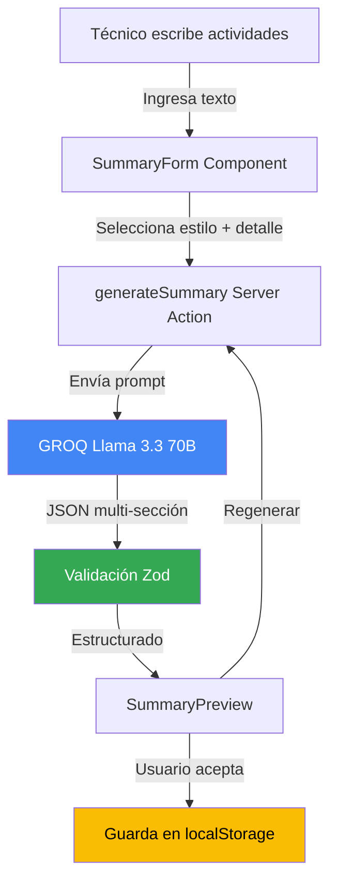

# AI Activity Summaries - Roadmap de Implementación

**Responsables:** Jose Miserol, Aaron Carreño, Edgar Morales  
**Feature:** AI Generated Activity Summaries (Resúmenes de Actividad Generados por IA)  
**Propósito:** La IA autogenera resúmenes de actividad, reduciendo el tiempo administrativo y mejorando la documentación

---

## Tabla de Contenidos

1. [Visión General](#visión-general)
2. [Estructura de Carpetas](#estructura-de-carpetas)
3. [Arquitectura del Sistema](#arquitectura-del-sistema)
4. [Flujo de Trabajo](#flujo-de-trabajo)
5. [Componentes Principales](#componentes-principales)
6. [Server Actions](#server-actions)
7. [Servicios](#servicios)
8. [Configuración](#configuración)
9. [Ejemplos de Uso](#ejemplos-de-uso)

---

## Prerequisitos

### Conceptos de JavaScript/TypeScript

- Promises y async/await
- String manipulation y template literals
- TypeScript types y interfaces

### Conceptos de React

- useState para forms multi-campo
- Controlled components
- Textarea auto-resize

### Conceptos de IA

- Temperature para creatividad controlada
- Token limits y word counting

---

## Visión General

AI Activity Summaries es una funcionalidad que **transforma notas técnicas en resúmenes profesionales** automáticamente. El sistema:

1. **Recibe notas** del técnico (texto libre)
2. **Selecciona estilo** (ejecutivo, técnico, narrativo)
3. **Define nivel de detalle** (bajo, medio, alto)
4. **Genera resumen** con IA estructurado en secciones
5. **Calcula métricas** (word count, reading time)

### Casos de Uso

- Técnico escribe: "Cambié filtro HVAC, estaba muy sucio, probé sistema ok"
- IA genera resumen ejecutivo: "Se completó mantenimiento preventivo de HVAC con reemplazo de filtro. Sistema operando normalmente post-intervención."

---

## Estructura de Carpetas

```
app/
├── tools/activity-summaries/              # ⭐ Página principal
│   └── page.tsx
│
├── components/features/activity-summary/   # ⭐ Componentes UI
│   ├── summary-form.tsx                   # Form de input
│   ├── summary-preview.tsx                # Preview generado
│   ├── summary-history.tsx                # Historial
│   └── __tests__/
│
├── actions/
│   └── activity-summary.ts                # ⭐ generateSummary()
│
├── lib/services/
│   └── activity-summary-ai-service.ts     # Lógica de generación
│
└── types/
    └── activity-summary.ts                # ActivitySummary type
```

---

## Arquitectura del Sistema

### Diagrama de Flujo



### Capas del Sistema

| Capa               | Responsabilidad           | Ubicación                                     |
| ------------------ | ------------------------- | --------------------------------------------- |
| **UI**             | Form inputs, preview      | `components/features/activity-summary/`       |
| **Server Actions** | Generación con IA         | `actions/activity-summary.ts`                 |
| **Servicios**      | Lógica de prompt building | `lib/services/activity-summary-ai-service.ts` |
| **Validación**     | Schemas Zod               | `lib/schemas/activity-summary.schema.ts`      |

---

## Flujo de Trabajo

### Paso 1: Usuario ingresa actividades

```typescript
// En SummaryForm
const [activities, setActivities] = useState('');
const [assetType, setAssetType] = useState('');
const [taskType, setTaskType] = useState('');
const [style, setStyle] = useState<'formal' | 'technical' | 'brief'>('technical');
const [detailLevel, setDetailLevel] = useState<'low' | 'medium' | 'high'>('medium');
```

**Campos:**

- **Actividades:** Texto libre (máx 2000 caracteres)
- **Tipo de activo:** HVAC, Bomba, etc.
- **Tipo de tarea:** Preventivo, Correctivo
- **Estilo:** Formal, Técnico, Breve
- **Detalle:** Bajo (1-2 párrafos), Medio (3-4), Alto (5+)

### Paso 2: Generación

```typescript
// Server Action
export async function generateSummary(params: {
  activities: string;
  assetType: string;
  taskType: string;
  style: SummaryStyle;
  detailLevel: DetailLevel;
}) {
  const result = await generateText({
    model: groq('llama-3.3-70b-versatile'),
    temperature: 0.4, // Balance creatividad/precisión
    messages: [
      {
        role: 'user',
        content: buildSummaryPrompt(params),
      },
    ],
  });

  const summary = parseSummaryResponse(result.text);
  return {
    ...summary,
    wordCount: countWords(summary.executiveSummary),
    readingTime: calculateReadingTime(summary.executiveSummary),
  };
}
```

**¿Por qué temperature 0.4?**

- Necesita redactar profesionalmente (creatividad)
- Mantener hechos técnicos exactos (precisión)

### Paso 3: Preview multi-sección

```typescript
// En SummaryPreview
<div>
  <h2>{summary.title}</h2>

  <section>
    <h3>Resumen Ejecutivo</h3>
    <p>{summary.executiveSummary}</p>
  </section>

  {summary.sections.map(section => (
    <section key={section.title}>
      <h3>{section.title}</h3>
      <p>{section.content}</p>
      {section.items && (
        <ul>
          {section.items.map(item => <li>{item}</li>)}
        </ul>
      )}
    </section>
  ))}

  <div className="metadata">
    <span>{summary.wordCount} palabras</span>
    <span>{summary.readingTime} min lectura</span>
  </div>
</div>
```

---

## Componentes Principales

### `SummaryForm.tsx`

**Props:**

```typescript
interface SummaryFormProps {
  onSummaryGenerated: (summary: ActivitySummary) => void;
  isGenerating: boolean;
}
```

**Validación:**

- Actividades: mínimo 50 caracteres
- Máximo 2000 caracteres
- Campos requeridos marcados

### `SummaryPreview.tsx`

**Props:**

```typescript
interface SummaryPreviewProps {
  summary: ActivitySummary;
  onAccept: () => void;
  onRegenerate: () => void;
  onEdit?: (summary: ActivitySummary) => void;
}
```

---

## Server Actions

### `generateSummary()`

**Firma:**

```typescript
async function generateSummary(params: {
  activities: string;
  assetType: string;
  taskType: string;
  style: 'formal' | 'technical' | 'brief';
  detailLevel: 'low' | 'medium' | 'high';
}): Promise<ActivitySummary>;
```

**Output:**

```typescript
interface ActivitySummary {
  id: string;
  title: string;
  executiveSummary: string; // 1-2 párrafos
  sections: Array<{
    title: string;
    content: string;
    items?: string[]; // Bullet points opcionales
  }>;
  wordCount: number;
  readingTime: number; // minutos
  style: SummaryStyle;
  detailLevel: DetailLevel;
  createdAt: Date;
}
```

---

## Servicios

### `ActivitySummaryAIService`

**Métodos:**

```typescript
class ActivitySummaryAIService {
  buildPrompt(params: SummaryParams): string {
    return `
Genera un resumen ${params.style} de actividades de mantenimiento.

Contexto:
- Activo: ${params.assetType}
- Tarea: ${params.taskType}
- Detalle: ${params.detailLevel}

Actividades realizadas:
${params.activities}

Formato JSON:
{
  "title": "título descriptivo",
  "executiveSummary": "resumen de 1-2 párrafos",
  "sections": [
    {
      "title": "Trabajo Realizado",
      "content": "...",
      "items": ["item 1", "item 2"]
    }
  ]
}
    `;
  }
}
```

---

## Configuración

### Estilos Disponibles

**Formal:**

- Lenguaje corporativo
- Tercera persona
- Sin jerga técnica

**Técnico:**

- Terminología específica
- Detalles procedimientos
- Datos técnicos

**Breve:**

- Bullet points
- Máximo 3 párrafos
- Solo lo esencial

### Niveles de Detalle

**Bajo:** 100-200 palabras  
**Medio:** 200-400 palabras  
**Alto:** 400-600 palabras

---

## Ejemplos de Uso

### Ejemplo 1: Resumen Técnico

```typescript
const summary = await generateSummary({
  activities: `
    - Reemplacé filtro de aire HVAC unidad 3
    - Limpieza de serpentines
    - Verificación de presiones (120psi normal)
    - Sistema operando correctamente
  `,
  assetType: 'hvac',
  taskType: 'preventivo',
  style: 'technical',
  detailLevel: 'medium',
});

// Output:
// Title: "Mantenimiento Preventivo HVAC Unidad 3"
// Executive Summary: "Se completó mantenimiento preventivo..."
// Sections: [
//   { title: "Trabajo Realizado", content: "...", items: [...] },
//   { title: "Hallazgos", content: "..." }
// ]
```

### Ejemplo 2: Resumen Ejecutivo

```typescript
const summary = await generateSummary({
  activities: 'Falla eléctrica bomba sector 2, reemplacé motor',
  assetType: 'bomba',
  taskType: 'correctivo',
  style: 'formal',
  detailLevel: 'low',
});

// Output más conciso, lenguaje corporativo
```

---

## Testing

```typescript
describe('ActivitySummaryAIService', () => {
  it('should generate summary with correct word count', async () => {
    const result = await service.generate({
      activities: 'Test activities',
      detailLevel: 'low',
    });

    expect(result.wordCount).toBeLessThan(250);
  });

  it('should respect style parameter', async () => {
    const technical = await service.generate({ style: 'technical' });
    const formal = await service.generate({ style: 'formal' });

    expect(technical.executiveSummary).not.toContain('tercera persona');
    expect(formal.executiveSummary).toMatch(/se realizó|fue completado/);
  });
});
```

---

## Limitaciones

- **Max input:** 2000 caracteres
- **Cache:** 1 hora TTL
- **Idioma:** Solo español actualmente

---

**Última actualización:** 2026-01-17  
**Versión:** 0.0.1  
**Mantenedores:** Jose Miserol, Aaron Carreño, Edgar Morales
