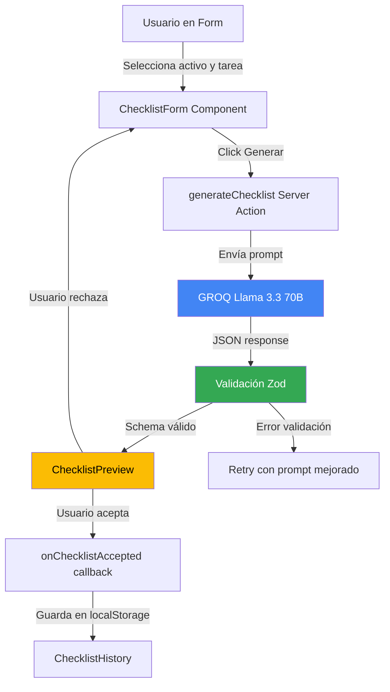

# Smart Checklist Builder - Roadmap de Implementación

**Responsables:** Jose Miserol, Miguelangel  
**Feature:** Smart Checklist Builder (Constructor Inteligente de Listas de Verificación)  
**Propósito:** Genera automáticamente listas de verificación para mantenimiento preventivo basándose en el tipo de activo y la tarea, estandarizando los pasos a seguir

---

## Tabla de Contenidos

1. [Visión General](#visión-general)
2. [Estructura de Carpetas](#estructura-de-carpetas)
3. [Arquitectura del Sistema](#arquitectura-del-sistema)
4. [Flujo de Trabajo](#flujo-de-trabajo)
5. [Componentes Principales](#componentes-principales)
6. [Server Actions](#server-actions)
7. [Servicios](#servicios)
8. [Configuración](#configuración)
9. [Ejemplos de Uso](#ejemplos-de-uso)

---

## Prerequisitos

Antes de estudiar este roadmap, un desarrollador junior debe entender:

### Conceptos de JavaScript/TypeScript

- Promises y async/await
- Arrays y métodos de manipulación (map, filter, reduce)
- TypeScript interfaces y types

### Conceptos de React

- Hooks (useState, useEffect)
- Controlled vs Uncontrolled components
- Event handlers

### Conceptos de Next.js

- Server Actions ('use server')
- Client vs Server Components

### Validación de Datos

- Zod schemas para validación
- Type inference con TypeScript

---

## Visión General

Smart Checklist Builder es una funcionalidad que permite **generar automáticamente listas de verificación** personalizadas para mantenimiento. El sistema:

1. **Recibe parámetros** del usuario (tipo de activo, tipo de tarea)
2. **Genera checklist** usando IA (GROQ Llama 3.3 70B)
3. **Valida estructura** con Zod schemas
4. **Guarda historial** en localStorage
5. **Permite editar** items antes de aceptar

### Casos de Uso

- Técnico crea checklist para mantenimiento preventivo de HVAC
- Generación rápida de pasos estandarizados
- Reducción de olvidos en inspecciones
- Documentación consistente entre técnicos

---

## Estructura de Carpetas

### ¿Dónde está cada cosa?

```
app/
├── tools/checklist-builder/              # ⭐ Página principal
│   └── page.tsx
│
├── components/features/checklist-builder/  # ⭐ Componentes UI
│   ├── checklist-form.tsx                 # Form de input
│   ├── checklist-preview.tsx              # Preview generado
│   ├── checklist-history.tsx              # Historial
│   └── __tests__/
│
├── lib/services/
│   └── checklist-ai-service.ts            # ⭐ Servicio de IA
│
├── lib/schemas/
│   └── checklist.schema.ts                # Validación Zod
│
├── constants/
│   └── ai.ts                              # ASSET_TYPES, TASK_TYPES
│
└── types/
    └── checklist.ts                       # Tipos TypeScript
```

### Leyenda

- ⭐ = Archivos críticos
- `__tests__/` = Tests unitarios

---

## Arquitectura del Sistema

### Diagrama de Flujo



### Capas del Sistema

| Capa               | Responsabilidad                | Ubicación                                |
| ------------------ | ------------------------------ | ---------------------------------------- |
| **UI**             | Form inputs, preview checklist | `components/features/checklist-builder/` |
| **Server Actions** | Llamada a IA                   | `tools/checklist-builder/actions.ts`     |
| **Servicios**      | Lógica de generación           | `lib/services/checklist-ai-service.ts`   |
| **Validación**     | Schemas Zod                    | `lib/schemas/checklist.schema.ts`        |
| **Tipos**          | TypeScript definitions         | `types/checklist.ts`                     |

---

## Flujo de Trabajo

### Paso 1: Usuario selecciona parámetros

```typescript
// En ChecklistForm
const [assetType, setAssetType] = useState('hvac');
const [taskType, setTaskType] = useState('preventivo');
const [additionalInstructions, setAdditionalInstructions] = useState('');
```

**¿Qué pasa?**

- Usuario elige de dropdown: HVAC, Bomba, Caldera, etc.
- Selecciona tipo de tarea: Preventivo, Correctivo, Predictivo
- (Opcional) Agrega instrucciones personalizadas

### Paso 2: Generación con IA

```typescript
// Server Action
export async function generateChecklist(params: {
  assetType: AssetType;
  taskType: TaskType;
  additionalInstructions?: string;
}) {
  const result = await generateText({
    model: groq('llama-3.3-70b-versatile'),
    temperature: 0.3,
    messages: [
      {
        role: 'user',
        content: CHECKLIST_PROMPT(params),
      },
    ],
  });

  // Parsear JSON y validar
  const checklist = checklistSchema.parse(JSON.parse(result.text));
  return checklist;
}
```

**¿Por qué?**

- `temperature: 0.3` → Creatividad controlada
- Zod parse → Asegura estructura correcta
- Retry automático si falla validación

### Paso 3: Preview y aceptación

```typescript
// En ChecklistPreview
<div>
  {checklist.items.map(item => (
    <div key={item.id}>
      <Checkbox checked={item.required} />
      <span>{item.description}</span>
      <small>{item.notes}</small>
    </div>
  ))}
  <Button onClick={() => onAccept(checklist)}>Aceptar</Button>
  <Button onClick={onReject}>Rechazar</Button>
</div>
```

---

## Componentes Principales

### `ChecklistForm.tsx`

**Props:**

```typescript
interface ChecklistFormProps {
  onChecklistGenerated: (checklist: Checklist) => void;
  isGenerating: boolean;
}
```

**Estados:**

- Idle → Generando → Preview → Aceptado

### `ChecklistPreview.tsx`

**Props:**

```typescript
interface ChecklistPreviewProps {
  checklist: Checklist;
  onAccept: (checklist: Checklist) => void;
  onReject: () => void;
  onRegenerate: () => void;
}
```

---

## Server Actions

### `generateChecklist()`

**Ubicación:** `app/tools/checklist-builder/actions.ts`

**Firma:**

```typescript
async function generateChecklist(params: {
  assetType: AssetType;
  taskType: TaskType;
  additionalInstructions?: string;
}): Promise<Checklist>;
```

**Proceso:**

1. Construir prompt con contexto
2. Llamar a GROQ Llama 3.3
3. Parsear JSON response
4. Validar con Zod
5. Retry si falla (máx 3 intentos)

---

## Servicios

### `ChecklistAIService`

**Ubicación:** `app/lib/services/checklist-ai-service.ts`

**Métodos:**

```typescript
class ChecklistAIService {
  async generate(params: ChecklistParams): Promise<Checklist> {
    // Lógica de generación
  }

  private buildPrompt(params: ChecklistParams): string {
    // Construye prompt dinámico
  }

  private validateResponse(response: unknown): Checklist {
    // Validación con Zod
  }
}
```

---

## Configuración

### Prompt Template

```typescript
export const CHECKLIST_PROMPT = (params) => `
Genera un checklist de mantenimiento ${params.taskType} para ${params.assetType}.

Formato JSON:
{
  "title": "string",
  "items": [
    {
      "id": "string",
      "description": "texto claro",
      "required": boolean,
      "notes": "string opcional"
    }
  ]
}

Requisitos:
- 5-15 items
- Orden lógico de ejecución
- Items críticos marcados como required
${params.additionalInstructions ? `\nInstrucciones adicionales: ${params.additionalInstructions}` : ''}
`;
```

---

## Ejemplos de Uso

### Ejemplo 1: Generación Básica

```typescript
import { generateChecklist } from '@/app/tools/checklist-builder/actions';

const checklist = await generateChecklist({
  assetType: 'hvac',
  taskType: 'preventivo',
});
```

### Ejemplo 2: Con Instrucciones Personalizadas

```typescript
const checklist = await generateChecklist({
  assetType: 'bomba',
  taskType: 'correctivo',
  additionalInstructions: 'Incluir verificación de ruido anormal',
});
```

---

## Testing

### Tests Recomendados

```typescript
describe('ChecklistAIService', () => {
  it('should generate valid checklist', async () => {
    const result = await service.generate({
      assetType: 'hvac',
      taskType: 'preventivo',
    });
    expect(result.items.length).toBeGreaterThan(0);
  });

  it('should validate response structure', () => {
    const invalid = { items: 'not an array' };
    expect(() => service.validateResponse(invalid)).toThrow();
  });
});
```

---

## Limitaciones

- **Cache:** 1 hora TTL
- **Max items:** 20 por checklist
- **Rate limiting:** Controlado por GROQ API

---

**Última actualización:** 2026-01-17  
**Versión:** 0.0.1  
**Mantenedores:** Jose Miserol, Miguelangel
