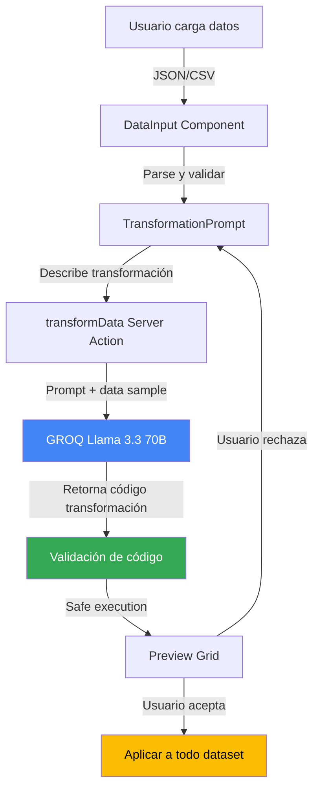

# Data Transformations - Roadmap de Implementación

**Responsables:** Jose Miserol, Elishama  
**Feature:** AI-Powered Data Transformations (Transformación de Datos por IA)  
**Propósito:** Utiliza lenguaje natural para reformatear datos (por ejemplo, convertir formatos de fecha o actualizar prioridades) durante las importaciones, arreglando datos desordenados con un solo comando

---

## Tabla de Contenidos

1. [Visión General](#visión-general)
2. [Estructura de Carpetas](#estructura-de-carpetas)
3. [Arquitectura del Sistema](#arquitectura-del-sistema)
4. [Flujo de Trabajo](#flujo-de-trabajo)
5. [Componentes Principales](#componentes-principales)
6. [Server Actions](#server-actions)
7. [Servicios](#servicios)
8. [Configuración](#configuración)
9. [Ejemplos de Uso](#ejemplos-de-uso)

---

## Prerequisitos

### Conceptos de JavaScript/TypeScript

- Array methods (map, filter, reduce)
- Object manipulation
- JSON parsing y stringify
- Regular expressions

### Conceptos de React

- useState para datos complejos
- useMemo para cálculos costosos
- Controlled tables/grids

### Validación de Datos

- Zod schemas dinámicos
- Type guards en TypeScript

---

## Visión General

Data Transformations es una funcionalidad que permite **transformar datasets usando lenguaje natural**. El sistema:

1. **Recibe datos** (JSON, CSV, o textarea)
2. **Usuario describe transformación** en lenguaje natural
3. **IA genera código** de transformación
4. **Preview de resultado** antes de aplicar
5. **Aplica cambios** y permite exportar

### Casos de Uso

**Ejemplo 1: Formato de fechas**

- Input: `"fecha": "05-12-2024"` (múltiples registros)
- Comando: "Convertir fechas al formato ISO 8601"
- Output: `"fecha": "2024-12-05T00:00:00Z"`

**Ejemplo 2: Normalizar prioridades**

- Input: Prioridades mezcladas ("Alta", "HIGH", "urgente")
- Comando: "Estandarizar prioridades a: urgent, high, normal, low"
- Output: Todas en formato consistente

---

## Estructura de Carpetas

```
app/
├── tools/data-transformation/            # ⭐ Página principal
│   └── page.tsx
│
├── components/features/data-transformation/ # ⭐ Componentes UI
│   ├── data-input.tsx                    # Input de datos
│   ├── transformation-prompt.tsx         # Descripción transformación
│   ├── preview-grid.tsx                  # Preview antes/después
│   ├── transformation-history.tsx        # Historial
│   └── __tests__/
│
├── actions/
│   └── data-transformation.ts            # transformData()
│
├── lib/services/
│   └── data-transformation-ai-service.ts # ⭐ Lógica principal
│
└── types/
    └── data-transformation.ts            # Transformation types
```

---

## Arquitectura del Sistema

### Diagrama de Flujo



### Capas del Sistema

| Capa               | Responsabilidad              | Ubicación                                        |
| ------------------ | ---------------------------- | ------------------------------------------------ |
| **UI**             | Input datos, preview         | `components/features/data-transformation/`       |
| **Server Actions** | Generación de transformación | `actions/data-transformation.ts`                 |
| **Servicios**      | Ejecución segura de código   | `lib/services/data-transformation-ai-service.ts` |
| **Validación**     | Schema validation            | `lib/schemas/transformation.schema.ts`           |

---

## Flujo de Trabajo

### Paso 1: Cargar Datos

```typescript
// En DataInput
const [data, setData] = useState<Record<string, any>[]>([]);

const handleFileUpload = (e: React.ChangeEvent<HTMLInputElement>) => {
  const file = e.target.files?.[0];
  if (file.type === 'application/json') {
    // Parse JSON
  } else if (file.type === 'text/csv') {
    // Parse CSV a JSON
  }
};
```

**Formatos soportados:**

- JSON array of objects
- CSV con headers
- Textarea (JSON manual)

### Paso 2: Describir Transformación

```typescript
// En TransformationPrompt
<Textarea
  value={transformationPrompt}
  onChange={(e) => setTransformationPrompt(e.target.value)}
  placeholder="Describe la transformación, ej: 'Convertir fechas a ISO 8601'"
/>
```

**Ejemplos de prompts:**

- "Convertir todas las fechas al formato YYYY-MM-DD"
- "Cambiar prioridades a lowercase"
- "Combinar campos firstName y lastName en fullName"
- "Eliminar campo obsoleto 'oldField'"

### Paso 3: Generación y Preview

```typescript
// Server Action
export async function transformData(params: {
  dataSample: Record<string, any>[]; // Primeros 5 registros
  transformationPrompt: string;
  fullDataset: Record<string, any>[];
}) {
  const result = await generateText({
    model: groq('llama-3.3-70b-versatile'),
    temperature: 0.1, // Muy determinístico para código
    messages: [
      {
        role: 'user',
        content: buildTransformationPrompt(params),
      },
    ],
  });

  // Parsear código JavaScript generado
  const code = extractCode(result.text);

  // Ejecutar en sandbox con sample
  const previewResults = executeSafely(code, params.dataSample);

  return {
    code,
    preview: previewResults,
    isValid: validateTransformation(previewResults),
  };
}
```

**¿Por qué temperature 0.1?**

- Necesitamos código exacto y reproducible
- Transformaciones deben ser consistentes
- Mínima creatividad, máxima precisión

### Paso 4: Revisión

```typescript
// En PreviewGrid
<table>
  <thead>
    <tr>
      <th>Campo</th>
      <th>Antes</th>
      <th>Después</th>
    </tr>
  </thead>
  <tbody>
    {Object.keys(preview[0]).map(field => (
      <tr>
        <td>{field}</td>
        <td>{data[0][field]}</td>
        <td>{preview[0][field]}</td>
      </tr>
    ))}
  </tbody>
</table>
```

---

## Componentes Principales

### `DataInput.tsx`

**Props:**

```typescript
interface DataInputProps {
  onDataLoaded: (data: Record<string, any>[]) => void;
  maxRows?: number; // Default 1000
}
```

**Validaciones:**

- Mínimo 1 registro
- Máximo 1000 registros (performance)
- JSON válido
- CSV con headers

### `PreviewGrid.tsx`

**Props:**

```typescript
interface PreviewGridProps {
  originalData: Record<string, any>[];
  transformedData: Record<string, any>[];
  onAccept: () => void;
  onReject: () => void;
}
```

---

## Server Actions

### `transformData()`

**Firma:**

```typescript
async function transformData(params: {
  dataSample: Record<string, any>[];
  transformationPrompt: string;
  fullDataset: Record<string, any>[];
}): Promise<TransformationResult>;
```

**Output:**

```typescript
interface TransformationResult {
  code: string; // JavaScript generado
  preview: Record<string, any>[]; // Sample transformado
  isValid: boolean;
  appliedCount: number;
  errors?: string[];
}
```

---

## Servicios

### `DataTransformationAIService`

**Métodos clave:**

```typescript
class DataTransformationAIService {
  buildPrompt(params: TransformParams): string {
    return `
Genera código JavaScript para transformar este dataset.

Sample de datos (primeros 3 registros):
${JSON.stringify(params.dataSample.slice(0, 3), null, 2)}

Transformación solicitada:
"${params.transformationPrompt}"

Genera función:
function transform(data) {
  return data.map(item => {
    // Tu código aquí
    return transformedItem;
  });
}

Requisitos:
- Solo usa JavaScript vanilla
- No uses librerías externas
- Retorna array del mismo tamaño
- No modifiques estructura si no es necesario
    `;
  }

  executeSafely(code: string, data: any[]): any[] {
    // Sandbox execution con timeout
    const sandbox = {
      data: JSON.parse(JSON.stringify(data)), // Deep clone
      console: { log: () => {} }, // Disable console
    };

    const func = new Function('data', code + '\nreturn transform(data);');
    const result = func.call(sandbox, sandbox.data);

    return result;
  }
}
```

---

## Configuración

### Operaciones Permitidas

```typescript
export const ALLOWED_OPERATIONS = [
  'renombrar-campo',
  'convertir-tipo',
  'combinar-campos',
  'dividir-campo',
  'filtrar-registros',
  'ordenar-registros',
  'agregar-campo',
  'eliminar-campo',
  'calcular-campo',
] as const;
```

### Límites de Seguridad

```typescript
const SAFETY_LIMITS = {
  MAX_EXECUTION_TIME: 5000, // 5 segundos
  MAX_MEMORY: 50 * 1024 * 1024, // 50MB
  MAX_ROWS: 1000,
  ALLOWED_GLOBALS: ['Math', 'Date', 'String', 'Number'],
};
```

---

## Ejemplos de Uso

### Ejemplo 1: Convertir Fechas

**Input:**

```json
[
  { "id": 1, "fecha": "05-12-2024" },
  { "id": 2, "fecha": "20-11-2024" }
]
```

**Prompt:** "Convertir fechas de DD-MM-YYYY a ISO 8601"

**Output:**

```json
[
  { "id": 1, "fecha": "2024-12-05T00:00:00Z" },
  { "id": 2, "fecha": "2024-11-20T00:00:00Z" }
]
```

### Ejemplo 2: Normalizar Enums

**Input:**

```json
[{ "priority": "Alta" }, { "priority": "HIGH" }, { "priority": "urgente" }]
```

**Prompt:** "Normalizar prioridades a: urgent, high, normal, low"

**Output:**

```json
[{ "priority": "high" }, { "priority": "high" }, { "priority": "urgent" }]
```

### Ejemplo 3: Combinar Campos

**Input:**

```json
[{ "firstName": "Juan", "lastName": "Pérez" }]
```

**Prompt:** "Combinar firstName y lastName en campo fullName"

**Output:**

```json
[{ "firstName": "Juan", "lastName": "Pérez", "fullName": "Juan Pérez" }]
```

---

## Testing

```typescript
describe('DataTransformationAIService', () => {
  it('should transform dates correctly', async () => {
    const result = await service.transform({
      data: [{ fecha: '05-12-2024' }],
      prompt: 'Convert dates to ISO',
    });

    expect(result[0].fecha).toMatch(/\d{4}-\d{2}-\d{2}/);
  });

  it('should handle malformed data safely', () => {
    expect(() => {
      service.executeSafely('throw new Error()', [{}]);
    }).toThrow();
  });
});
```

---

## Limitaciones

### Seguridad

- Código ejecutado en sandbox limitado
- Sin acceso a filesystem, network, process
- Timeout de 5 segundos

### Performance

- Máximo 1000 registros
- Transformaciones complejas pueden tardar

### Operaciones No Soportadas

- Llamadas async (fetch, setTimeout)
- Acceso a DOM
- Uso de librerías externas

---

**Última actualización:** 2026-01-17  
**Versión:** 0.0.1  
**Mantenedores:** Jose Miserol, Elishama
