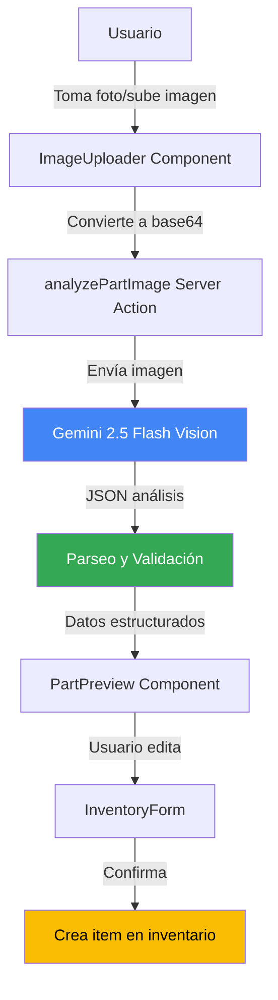

# Photo-to-Part Creation - Roadmap de Implementación

**Responsables:** Jose Miserol, Junior González  
**Feature:** Photo-to-Part Creation (Creación de Piezas a partir de Fotos)  
**Propósito:** Permite tomar una fotografía de una pieza y deja que la IA sugiera el nombre, tipo y cantidad para crear automáticamente ítems en el inventario

---

## Tabla de Contenidos

1. [Visión General](#visión-general)
2. [Estructura de Carpetas](#estructura-de-carpetas)
3. [Arquitectura del Sistema](#arquitectura-del-sistema)
4. [Flujo de Trabajo](#flujo-de-trabajo)
5. [Componentes Principales](#componentes-principales)
6. [Server Actions](#server-actions)
7. [Configuración](#configuración)
8. [Ejemplos de Uso](#ejemplos-de-uso)

---

## Prerequisitos

### Conceptos de JavaScript/TypeScript

- Promises y async/await
- FileReader y Blob para imágenes
- Base64 encoding

### Conceptos de React

- Hooks (useState, useRef)
- Event handling (onChange para file input)
- Controlled components

### Conceptos de Next.js

- Server Actions ('use server')
- Image optimization con next/image

### Web APIs

- File API para captura de imágenes
- Camera API (getUserMedia)

---

## Visión General

Photo-to-Part Creation es una funcionalidad que permite **analizar imágenes de piezas industriales** con IA para generar automáticamente información de inventario. El sistema:

1. **Captura/sube imagen** de la pieza
2. **Analiza con Vision AI** (Gemini 2.5 Flash)
3. **Extrae información**: nombre, tipo, marca, estado
4. **Sugiere cantidad** basada en contexto visual
5. **Crea item de inventario** automáticamente

### Casos de Uso

- Técnico fotografía rodamiento desgastado
- IA identifica: "Rodamiento SKF 6205, estado: reemplazo necesario"
- Sistema sugiere agregar 2 unidades al inventario
- Técnico confirma y guarda

---

## Estructura de Carpetas

```
app/
├── tools/photo-to-part/                  # ⭐ Página principal
│   └── page.tsx
│
├── components/features/photo-to-part/     # ⭐ Componentes UI
│   ├── image-uploader.tsx                # Upload/camera
│   ├── part-preview.tsx                  # Preview análisis
│   ├── inventory-form.tsx                # Form editable
│   └── __tests__/
│
├── actions/
│   └── vision.ts                         # ⭐ analyzePartImage()
│
├── lib/services/
│   └── inventory-ai-service.ts           # Lógica de análisis
│
└── types/
    └── inventory.ts                      # PartAnalysis type
```

---

## Arquitectura del Sistema

### Diagrama de Flujo



### Capas del Sistema

| Capa               | Responsabilidad         | Ubicación                              |
| ------------------ | ----------------------- | -------------------------------------- |
| **UI**             | Captura imagen, preview | `components/features/photo-to-part/`   |
| **Server Actions** | Análisis con Vision AI  | `actions/vision.ts`                    |
| **Servicios**      | Lógica de inventario    | `lib/services/inventory-ai-service.ts` |
| **Validación**     | Estructura de datos     | `lib/schemas/part.schema.ts`           |

---

## Flujo de Trabajo

### Paso 1: Captura de Imagen

```typescript
// En ImageUploader
const handleImageCapture = (e: React.ChangeEvent<HTMLInputElement>) => {
  const file = e.target.files?.[0];
  if (!file) return;

  const reader = new FileReader();
  reader.onload = async () => {
    const base64Image = reader.result as string;
    await analyzeImage(base64Image);
  };
  reader.readAsDataURL(file);
};
```

**Opciones:**

- Upload desde galería
- Captura con cámara (mobile)
- Copy-paste de clipboard

### Paso 2: Análisis con Vision AI

```typescript
// Server Action en actions/vision.ts
export async function analyzePartImage(imageDataUrl: string) {
  const result = await generateText({
    model: google('gemini-2.5-flash'),
    temperature: 0.2,
    messages: [
      {
        role: 'user',
        content: [
          { type: 'text', text: INVENTORY_PROMPT },
          { type: 'image', image: imageDataUrl },
        ],
      },
    ],
  });

  return parsePartAnalysis(result.text);
}
```

**¿Por qué temperature 0.2?**

- Necesitamos precisión en identificación
- Algo de creatividad para descripciones
- Balance entre exactitud y utilidad

### Paso 3: Preview y Edición

```typescript
// En PartPreview
<div>
  
  <div>
    <strong>Nombre sugerido:</strong> {analysis.name}
    <strong>Tipo:</strong> {analysis.type}
    <strong>Marca:</strong> {analysis.brand || 'No detectada'}
    <strong>Estado:</strong> {analysis.condition}
    <strong>Cantidad sugerida:</strong> {analysis.suggestedQuantity}
  </div>
  <Button onClick={() => onAccept(analysis)}>Crear Item</Button>
</div>
```

---

## Componentes Principales

### `ImageUploader.tsx`

**Props:**

```typescript
interface ImageUploaderProps {
  onImageAnalyzed: (analysis: PartAnalysis) => void;
  maxFileSize?: number; // Default 10MB
}
```

**Features:**

- Drag & drop
- Preview thumbnail
- Progress indicator durante análisis
- Error handling (tamaño, formato)

### `PartPreview.tsx`

**Props:**

```typescript
interface PartPreviewProps {
  analysis: PartAnalysis;
  imageUrl: string;
  onAccept: (analysis: PartAnalysis) => void;
  onRetake: () => void;
}
```

**Display:**

- Imagen original
- Campos extraídos por IA
- Botones de acción (aceptar/reanalizar)

---

## Server Actions

### `analyzePartImage()`

**Ubicación:** `app/actions/vision.ts`

**Firma:**

```typescript
async function analyzePartImage(imageDataUrl: string, mediaType?: string): Promise<PartAnalysis>;
```

**Proceso:**

1. Validar tamaño de imagen (max 10MB)
2. Enviar a Gemini Vision con prompt especializado
3. Parsear respuesta JSON
4. Validar estructura con Zod
5. Retornar análisis o error

**Output:**

```typescript
interface PartAnalysis {
  name: string;
  type: 'mechanical' | 'electrical' | 'hydraulic' | 'other';
  brand?: string;
  model?: string;
  condition: 'new' | 'good' | 'worn' | 'damaged';
  suggestedQuantity: number;
  confidence: number; // 0-1
  notes: string;
}
```

---

## Configuración

### Prompt para Vision AI

```typescript
export const INVENTORY_PROMPT = `
Analiza esta imagen de una pieza industrial/mecánica.

Identifica:
1. Nombre de la pieza (ej: "Rodamiento de bolas")
2. Tipo (mechanical/electrical/hydraulic/other)
3. Marca visible (SKF, Timken, etc.) - null si no visible
4. Modelo/código (si legible)
5. Estado visual (new/good/worn/damaged)
6. Cantidad que se recomienda tener en inventario (basado en criticidad)

Retorna JSON:
{
  "name": "string",
  "type": "mechanical | electrical | hydraulic | other",
  "brand": "string | null",
  "model": "string | null",
  "condition": "new | good | worn | damaged",
  "suggestedQuantity": number,
  "confidence": 0-1,
  "notes": "observaciones técnicas"
}

Si la imagen no es clara o no es una pieza, confidence debe ser < 0.5
`;
```

---

## Ejemplos de Uso

### Ejemplo 1: Flujo Completo

```typescript
import { PhotoToPartUploader } from '@/app/components/features/photo-to-part';

function InventoryPage() {
  const handlePartCreated = async (analysis: PartAnalysis) => {
    // Guardar en DB
    await createInventoryItem({
      ...analysis,
      createdBy: user.id,
      location: currentLocation
    });

    toast.success(`Item "${analysis.name}" agregado al inventario`);
  };

  return <PhotoToPartUploader onPartCreated={handlePartCreated} />;
}
```

### Ejemplo 2: Con Validación de Confianza

```typescript
const handleAnalysis = (analysis: PartAnalysis) => {
  if (analysis.confidence < 0.7) {
    showWarning('La IA tiene baja confianza. Revisa los datos.');
  }

  setPartData(analysis);
};
```

---

## Testing

### Tests Recomendados

```typescript
describe('analyzePartImage', () => {
  it('should identify bearing from image', async () => {
    const bearingImage = 'data:image/jpeg;base64,...';
    const result = await analyzePartImage(bearingImage);

    expect(result.type).toBe('mechanical');
    expect(result.confidence).toBeGreaterThan(0.7);
  });

  it('should handle unclear images', async () => {
    const blurryImage = 'data:image/jpeg;base64,...';
    const result = await analyzePartImage(blurryImage);

    expect(result.confidence).toBeLessThan(0.5);
  });
});
```

---

## Limitaciones

### Tamaño de Imagen

- **Max:** 10MB
- **Recomendado:** 2-5MB para balance calidad/velocidad

### Precisión

- **Depende de:**
  - Iluminación de la foto
  - Ángulo de captura
  - Limpieza de la pieza
  - Marcas visibles

### Tipos de Piezas

- **Mejor rendimiento:** Piezas estándar con marcas
- **Menor precisión:** Piezas custom o sin etiquetas

---

**Última actualización:** 2026-01-17  
**Versión:** 0.0.1  
**Mantenedores:** Jose Miserol, Junior González
