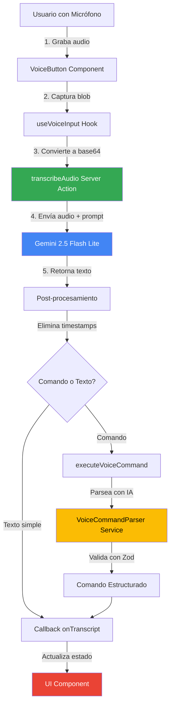
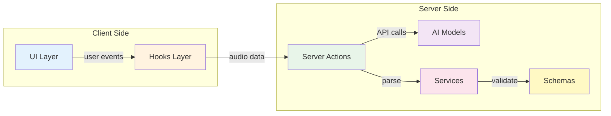

# Voice Fill - Roadmap de Implementación

**Responsables:** Jose Miserol, Omar Castellano
**Feature:** Voice Fill (Relleno por Voz)  
**Propósito:** Permite dictar notas o actualizaciones sobre la marcha; la IA transcribe el habla directamente en las órdenes de trabajo y solicitudes

---

## Tabla de Contenidos

1. [Visión General](#visión-general)
2. [Estructura de Carpetas](#estructura-de-carpetas)
3. [Arquitectura del Sistema](#arquitectura-del-sistema)
4. [Flujo de Trabajo](#flujo-de-trabajo)
5. [Componentes Principales](#componentes-principales)
6. [Server Actions](#server-actions)
7. [Hooks de React](#hooks-de-react)
8. [Servicios](#servicios)
9. [Configuración](#configuración)
10. [Ejemplos de Uso](#ejemplos-de-uso)

---

## Prerequisitos

Antes de estudiar este roadmap, un desarrollador junior debe entender:

### Conceptos de JavaScript/TypeScript

**Promises y async/await**

```typescript
// Necesitas entender este patrón
const result = await someAsyncFunction();
```

- [MDN: Promises](https://developer.mozilla.org/es/docs/Web/JavaScript/Reference/Global_Objects/Promise)
- [MDN: async/await](https://developer.mozilla.org/es/docs/Web/JavaScript/Reference/Statements/async_function)

**FileReader y Blob**

```typescript
// Conversión de archivos binarios a texto base64
const reader = new FileReader();
reader.readAsDataURL(blob); // Blob → base64 string
```

- [MDN: FileReader](https://developer.mozilla.org/es/docs/Web/API/FileReader)
- [MDN: Blob](https://developer.mozilla.org/es/docs/Web/API/Blob)

### Conceptos de React

**Hooks (useState, useEffect, useCallback)**

```typescript
const [state, setState] = useState(initialValue);
useEffect(() => {
  /* side effect */
}, [dependencies]);
const memoizedCallback = useCallback(() => {
  /* function */
}, [deps]);
```

- [React Docs: Hooks](https://react.dev/reference/react)

**Custom Hooks**

```typescript
// Reutilización de lógica con estado
function useCustomHook() {
  const [value, setValue] = useState();
  return { value, setValue };
}
```

### Conceptos de Next.js

**Server Actions ('use server')**

```typescript
'use server';
export async function myServerAction(data: string) {
  // Se ejecuta en el servidor, no en el navegador
}
```

- [Next.js Docs: Server Actions](https://nextjs.org/docs/app/building-your-application/data-fetching/server-actions-and-mutations)

**Diferencia Client vs Server Components**

- Client: Usa 'use client', puede usar hooks, estado, eventos del navegador
- Server: Ejecuta en servidor, no puede usar hooks, accede a DB directamente

### Web APIs del Navegador

**MediaRecorder API**

```typescript
// Captura audio/video del micrófono
const recorder = new MediaRecorder(stream);
recorder.start(); // Inicia grabación
recorder.stop(); // Detiene y dispara evento 'dataavailable'
```

- [MDN: MediaRecorder](https://developer.mozilla.org/es/docs/Web/API/MediaRecorder)

**getUserMedia() para permisos**

```typescript
// Solicita acceso al micrófono
const stream = await navigator.mediaDevices.getUserMedia({ audio: true });
```

### Formatos de Datos

**Base64 Encoding**

- ¿Qué es? Representación de datos binarios como texto ASCII
- ¿Por qué? Permite enviar audio en JSON (APIs REST requieren texto)
- Formato: `data:audio/webm;base64,UklGRiQAAABXQVZFZm10...`

**MIME Types**

- `audio/webm` - Formato de Chrome/Firefox
- `audio/mp4` - Formato de Safari
- Importante: Cada navegador soporta diferentes codecs

---

## Visión General

Voice Fill es una funcionalidad que permite a los usuarios **dictar por voz** en lugar de escribir texto manualmente. El sistema:

1. **Captura audio** del micrófono del usuario
2. **Transcribe** usando IA (Gemini Flash Lite)
3. **Procesa** comandos de voz específicos (opcional)
4. **Rellena** automáticamente campos de órdenes de trabajo

### Casos de Uso

- Técnicos en campo dictando hallazgos
- Creación rápida de órdenes de trabajo sin teclado
- Actualización de status de activos por voz
- Comandos de navegación manos libres

---

## Estructura de Carpetas

### ¿Dónde está cada cosa?

```
app/
├── actions/
│   ├── voice.ts                          # ⭐ Server Actions principales
│   └── __tests__/
│       └── actions-voice.test.ts         # Tests de server actions
│
├── components/features/voice/            # ⭐ Componentes UI de voz
│   ├── voice-button.tsx                  # Botón de entrada de voz
│   ├── voice-command-mode.tsx            # Modo comandos de voz
│   ├── hooks/
│   │   ├── use-voice-command-flow.ts     # Flujo de comandos
│   │   ├── use-voice-navigation.ts       # Navegación por voz
│   │   └── use-voice-system.ts           # Sistema de voz
│   └── __tests__/                        # Tests de componentes
│
├── components/features/chat/
│   └── types/
│       └── voice-props.types.ts          # Tipos para props de voz
│
├── hooks/
│   ├── use-voice-input.ts                # ⭐ Hook principal de entrada de voz
│   └── __tests__/
│       └── use-voice-input.test.ts       # Tests del hook
│
├── lib/services/
│   └── voice-command-parser.ts           # ⭐ Servicio de parsing de comandos
│
├── config/
│   ├── voice-command-prompt.ts           # Prompts para comandos
│   └── voice-master-prompt.ts            # Prompt master de voz
│
└── types/
    ├── voice-commands.ts                 # Tipos de comandos de voz
    └── __tests__/
        └── voice-commands.test.ts        # Tests de tipos
```

### Leyenda

- ⭐ = Archivos críticos para entender Voice Fill
- `__tests__/` = Carpetas de tests unitarios

---

## Arquitectura del Sistema

### Diagrama de Flujo



### Capas del Sistema



| Capa               | Responsabilidad                 | Ubicación                              |
| ------------------ | ------------------------------- | -------------------------------------- |
| **UI**             | Captura de audio, visualización | `components/features/voice/`           |
| **Hooks**          | Lógica de estado y efectos      | `hooks/use-voice-input.ts`             |
| **Server Actions** | Comunicación con IA             | `actions/voice.ts`                     |
| **Servicios**      | Parsing de comandos             | `lib/services/voice-command-parser.ts` |
| **Configuración**  | Prompts y constantes            | `config/voice-*.ts`                    |
| **Tipos**          | Definiciones TypeScript         | `types/voice-commands.ts`              |

---

## Flujo de Trabajo

### Paso a Paso: ¿Cómo funciona?

#### 1. Usuario inicia grabación

```typescript
// En VoiceButton.tsx
<Button onClick={handleStartRecording}>
  🎤 Hablar
</Button>
```

**¿Qué pasa?**

- Se solicita permiso de micrófono
- Se inicia `MediaRecorder`
- El estado cambia a "recording"

#### 2. Usuario habla y detiene

**¿Qué pasa?**

- Se captura el audio en un `Blob`
- Se convierte a base64 usando `FileReader`

```typescript
// En use-voice-input.ts
const reader = new FileReader();
reader.onload = () => {
  const base64Audio = reader.result as string;
  // Enviar a transcripción
};
reader.readAsDataURL(audioBlob);
```

#### 3. Transcripción en servidor

```typescript
// En actions/voice.ts (Server Action)
export async function transcribeAudio(audioDataUrl: string) {
  const result = await generateText({
    model: google('gemini-2.5-flash-lite'),
    temperature: 0,
    messages: [
      {
        role: 'user',
        content: [
          { type: 'text', text: VOICE_PROMPT },
          { type: 'file', data: base64Content, mediaType: 'audio/webm' },
        ],
      },
    ],
  });

  return { text: cleanText, success: true };
}
```

**¿Por qué?**

- `temperature: 0` → Respuestas determinísticas
- `VOICE_PROMPT` → Instrucciones para eliminar muletillas
- Limpieza regex → Eliminar timestamps `00:00`

#### 4. Retorno y actualización UI

```typescript
// En use-voice-input.ts
const { text, success } = await transcribeAudio(base64Audio);
if (success) {
  onTranscript?.(text); // Callback al componente padre
}
```

#### 5. (Opcional) Parsing de comandos

```typescript
// Si es un comando de voz
const result = await executeVoiceCommand(transcript);
if (result.success) {
  // result.command contiene: action, parameters, confidence
  handleCommand(result.command);
}
```

---

## Componentes Principales

### 1. `VoiceButton.tsx`

**Ubicación:** `app/components/features/voice/voice-button.tsx`

**Propósito:** Botón UI para capturar audio

**Props:**

```typescript
interface VoiceButtonProps {
  onTranscript: (text: string) => void; // Callback con texto transcrito
  disabled?: boolean; // Deshabilitar botón
  className?: string; // Clases CSS
}
```

**Estados:**

- `idle` - Esperando click
- `recording` - Grabando audio
- `processing` - Enviando a IA
- `success` - Transcripción completada
- `error` - Error en el proceso

**Uso:**

```typescript
<VoiceButton
  onTranscript={(text) => setMessage(text)}
  disabled={isLoading}
/>
```

### 2. `VoiceCommandMode.tsx`

**Ubicación:** `app/components/features/voice/voice-command-mode.tsx`

**Propósito:** Modo especial para comandos de órdenes de trabajo

**Características:**

- Preview del comando interpretado
- Botón de confirmar/rechazar
- Visualización de parámetros extraídos

---

## Server Actions

### `transcribeAudio()`

**Ubicación:** `app/actions/voice.ts`

**Firma:**

```typescript
async function transcribeAudio(
  audioDataUrl: string,
  mimeType: string = 'audio/webm'
): Promise<{
  text: string;
  success: boolean;
  error?: string;
}>;
```

**¿Cómo funciona?**

1. **Validación de tamaño**

   ```typescript
   if (sizeInMB > MAX_AUDIO_SIZE_MB) {
     throw new Error(`Audio demasiado grande`);
   }
   ```

2. **Llamada a Gemini**
   - Modelo: `gemini-2.5-flash-lite`
   - Temperature: `0` (determinístico)
   - Prompt: Instrucciones de limpieza

3. **Post-procesamiento**

   ```typescript
   const cleanText = result.text
     .replace(/\d{1,2}:\d{2}/g, '') // Quitar timestamps
     .replace(/\n+/g, ' ') // Unir líneas
     .replace(/\s+/g, ' ') // Espacios dobles
     .trim();
   ```

4. **Manejo de errores**
   - Logging con `logger.error()`
   - Retorno de mensaje de error user-friendly

### `executeVoiceCommand()`

**Ubicación:** `app/actions/voice.ts`

**Firma:**

```typescript
async function executeVoiceCommand(
  transcript: string,
  options?: {
    minConfidence?: number;
    context?: string;
  }
);
```

**¿Para qué?**

- Parsea comandos como "Crear orden urgente para la UMA"
- Extrae: acción, parámetros, entidades
- Valida con Zod schemas

**Resultado:**

```typescript
{
  success: true,
  command: {
    action: 'create_work_order',
    parameters: {
      priority: 'urgent',
      assetType: 'UMA',
      // ...
    },
    confidence: 0.95
  }
}
```

---

## Hooks de React

### `useVoiceInput()`

**Ubicación:** `app/hooks/use-voice-input.ts`

**Propósito:** Hook principal para captura y transcripción de voz

**Uso:**

```typescript
const { isRecording, startRecording, stopRecording, transcript, error } = useVoiceInput({
  onTranscript: (text) => console.log(text),
  onError: (err) => console.error(err),
});
```

**¿Qué maneja?**

- Permisos de micrófono
- Estado de grabación
- Conversión blob → base64
- Llamada a server action
- Manejo de errores

### `useVoiceSystem()`

**Ubicación:** `app/components/features/voice/hooks/use-voice-system.ts`

**Propósito:** Sistema completo de voz con fallback a Web Speech API

**Características:**

- Detección automática de soporte
- Fallback si Gemini falla
- Gestión de permisos

### `useVoiceCommandFlow()`

**Ubicación:** `app/components/features/voice/hooks/use-voice-command-flow.ts`

**Propósito:** Flujo completo de comandos de voz

**Estados:**

- idle → listening → processing → preview → confirmed/rejected

---

## Servicios

### `VoiceCommandParserService`

**Ubicación:** `app/lib/services/voice-command-parser.ts`

**Patrón:** Singleton

**Responsabilidad:** Parsear comandos de voz en JSON estructurado

**Métodos:**

#### `parseCommand()`

```typescript
async parseCommand(
  transcript: string,
  options: {
    minConfidence: number,
    context?: string,
    language: string
  }
): Promise<ParseResult>
```

**¿Cómo funciona?**

1. **Envía transcript a Gemini** con prompt de parsing
2. **Recibe JSON estructurado** con comando
3. **Valida con Zod** contra schemas
4. **Retorna comando tipado** o error

**Ejemplo:**

Input:

```
"Crear orden urgente para mantenimiento de la UMA del sector 3"
```

Output:

```typescript
{
  success: true,
  command: {
    type: 'work_order',
    action: 'create_work_order',
    parameters: {
      priority: 'urgent',
      assetType: 'UMA',
      sector: '3',
      taskType: 'maintenance'
    },
    confidence: 0.92
  }
}
```

---

## Configuración

### `VOICE_PROMPT`

**Ubicación:** `app/config/voice-master-prompt.ts`

**Contenido:**

```typescript
export const VOICE_PROMPT = `
Transcribe el siguiente audio en español.
REGLAS ESTRICTAS:
- NO incluyas timestamps (00:00, 01:23, etc.)
- NO incluyas etiquetas de speaker ([Speaker 1])
- NO incluyas muletillas excesivas (ehh, mmm, etc.)
- Retorna SOLO el texto hablado, limpio y natural
`;
```

**¿Por qué?**

- Gemini a veces incluye timestamps
- Necesitamos texto limpio para comandos
- Mejora UX al eliminar ruido

### `VOICE_COMMAND_PROMPT`

**Ubicación:** `app/config/voice-command-prompt.ts`

**Propósito:** Instrucciones para parsear comandos

**Estructura:**

- Descripción de entidades (UMA, BCA, TAB, ST)
- Formato de respuesta JSON
- Ejemplos de entrenamiento

---

## Ejemplos de Uso

### Ejemplo 1: Transcripción Simple

```typescript
import { VoiceButton } from '@/app/components/features/voice';

function MyForm() {
  const [description, setDescription] = useState('');

  return (
    <div>
      <Textarea value={description} onChange={(e) => setDescription(e.target.value)} />

      <VoiceButton
        onTranscript={(text) => setDescription(prev => prev + ' ' + text)}
      />
    </div>
  );
}
```

**Resultado:** Usuario habla → Texto se agrega al textarea

### Ejemplo 2: Comando de Orden de Trabajo

```typescript
import { VoiceCommandMode } from '@/app/components/features/voice';

function CreateWorkOrder() {
  const handleVoiceCommand = async (transcript: string) => {
    const result = await executeVoiceCommand(transcript);

    if (result.success && result.command.action === 'create_work_order') {
      // Rellenar form automáticamente
      setFormData({
        priority: result.command.parameters.priority,
        assetType: result.command.parameters.assetType,
        // ...
      });
    }
  };

  return <VoiceCommandMode onCommand={handleVoiceCommand} />;
}
```

**Resultado:** "Crear orden urgente para UMA" → Form se rellena automáticamente

### Ejemplo 3: Hook Personalizado

```typescript
import { useVoiceInput } from '@/app/hooks/use-voice-input';

function CustomVoiceFeature() {
  const { startRecording, stopRecording, isRecording, transcript } = useVoiceInput({
    onTranscript: (text) => {
      console.log('Usuario dijo:', text);
      // Tu lógica aquí
    }
  });

  return (
    <Button
      onClick={isRecording ? stopRecording : startRecording}
      variant={isRecording ? 'destructive' : 'default'}
    >
      {isRecording ? 'Detener' : 'Hablar'}
    </Button>
  );
}
```

---

## Testing

### Tests Unitarios

**Ubicación:** `app/actions/__tests__/actions-voice.test.ts`

**Cobertura:**

- Transcripción exitosa
- Manejo de errores
- Validación de tamaño
- Limpieza de timestamps

### Tests de Hooks

**Ubicación:** `app/hooks/__tests__/use-voice-input.test.ts`

**Cobertura:**

- Estado de grabación
- Conversión de audio
- Callbacks

### Ejecutar Tests

```bash
npm test                   # Todos los tests
npm test voice            # Solo tests de voice
npm run test:coverage     # Con cobertura
```

---

## Limitaciones y Consideraciones

### Tamaño de Audio

- **Máximo:** Definido en `MAX_AUDIO_SIZE_MB`
- **Razón:** Límites de API de Gemini
- **Solución:** Validación antes de enviar

### Idioma

- **Actual:** Solo español (`es-ES`)
- **Futuro:** Multi-idioma configurando `language` en parser

### Precisión

- **Depende de:**
  - Calidad del micrófono
  - Ruido ambiental
  - Claridad del hablante
- **Mejoras:**
  - Prompts mejorados
  - Validación de confianza mínima

### Privacidad

- **Audio NO se almacena** permanentemente
- **Se envía a Gemini** para transcripción
- **Cumple:** Políticas de Google AI

---

## Próximos Pasos

### Mejoras Técnicas

- [ ] Caché de transcripciones frecuentes
- [ ] Compresión de audio antes de enviar
- [ ] Retry automático en errores de red
- [ ] Métricas de precisión

---

## Recursos Adicionales

### Documentación Relacionada

- [API.md](../API.md) - Documentación completa de server actions
- [AI_TOOLS_GUIDE.md](../AI_TOOLS_GUIDE.md) - Guía de herramientas de IA
- [CONTRIBUTING.md](../CONTRIBUTING.md) - Guía para contribuir

### Enlaces Externos

- [Gemini API Docs](https://ai.google.dev/docs)
- [Web Speech API](https://developer.mozilla.org/en-US/docs/Web/API/Web_Speech_API)
- [MediaRecorder API](https://developer.mozilla.org/en-US/docs/Web/API/MediaRecorder)

---

**Última actualización:** 2026-01-17  
**Versión:** 0.0.1  
**Mantenedores:** Jose Miserol, Omar Castellano
