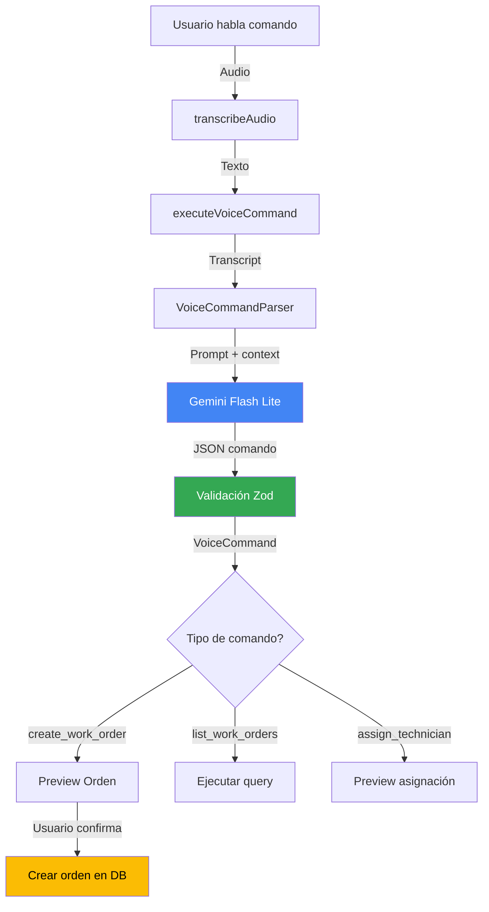

# Voice-Activated Requests - Roadmap de Implementación

**Responsables:** Jose Miserol, Juan Mora  
**Feature:** Voice-Activated Requests (Solicitudes Activadas por Voz)  
**Propósito:** Facilita el envío de órdenes de trabajo de manera rápida y manos libres mediante comandos de voz

---

## Tabla de Contenidos

1. [Visión General](#visión-general)
2. [Estructura de Carpetas](#estructura-de-carpetas)
3. [Arquitectura del Sistema](#arquitectura-del-sistema)
4. [Flujo de Trabajo](#flujo-de-trabajo)
5. [Componentes Principales](#componentes-principales)
6. [Server Actions](#server-actions)
7. [Servicios](#servicios)
8. [Configuración](#configuración)
9. [Ejemplos de Uso](#ejemplos-de-uso)

---

## Prerequisitos

### Conceptos de JavaScript/TypeScript

- Promises y async/await
- Pattern matching y regex
- TypeScript discriminated unions

### Conceptos de React

- useRef para mantener referencias
- Custom hooks composition
- Event handling

### Web APIs

- MediaRecorder para captura de audio
- Web Speech API (fallback)

---

## Visión General

Voice-Activated Requests es una funcionalidad que permite **crear órdenes de trabajo usando comandos de voz**. El sistema:

1. **Escucha comando** del usuario
2. **Transcribe** con Gemini Flash Lite
3. **Parsea intención** (crear, listar, asignar, etc.)
4. **Extrae parámetros** (prioridad, activo, ubicación)
5. **Ejecuta acción** o muestra preview para confirmar

### Casos de Uso

- Técnico en campo dice: "Crear orden urgente para la UMA del sector 3"
- Sistema entiende: `{ action: 'create', priority: 'urgent', asset: 'UMA', location: 'Sector 3' }`
- Muestra preview para confirmación
- Técnico confirma y orden se crea

---

## Estructura de Carpetas

```
app/
├── components/features/voice/              # ⭐ Reutilizado de Voice Fill
│   ├── voice-command-mode.tsx              # ⭐ Modo comandos
│   ├── voice-button.tsx
│   └── hooks/
│       ├── use-voice-command-flow.ts       # ⭐ Flujo completo
│       └── use-voice-navigation.ts
│
├── actions/
│   └── voice.ts                            # executeVoiceCommand()
│
├── lib/services/
│   └── voice-command-parser.ts             # ⭐ Parser de comandos
│
├── config/
│   └── voice-command-prompt.ts             # Prompt de parsing
│
└── types/
    └── voice-commands.ts                   # VoiceCommand types
```

---

## Arquitectura del Sistema

### Diagrama de Flujo



### Capas del Sistema

| Capa               | Responsabilidad         | Ubicación                              |
| ------------------ | ----------------------- | -------------------------------------- |
| **UI**             | Modo comandos, preview  | `components/features/voice/`           |
| **Hooks**          | Flujo de comandos       | `use-voice-command-flow.ts`            |
| **Server Actions** | Transcripción + parsing | `actions/voice.ts`                     |
| **Servicios**      | Lógica de parsing       | `lib/services/voice-command-parser.ts` |
| **Validación**     | Schemas por comando     | `lib/schemas/voice-command.schema.ts`  |

---

## Flujo de Trabajo

### Paso 1: Activar Modo Comandos

```typescript
// En WorkOrderPage
<VoiceCommandMode
  onCommandExecuted={(command) => {
    if (command.action === 'create_work_order') {
      handleCreateOrder(command.parameters);
    }
  }}
/>
```

**¿Qué pasa?**

- Botón "🎤 Usar comando de voz"
- Usuario presiona y habla
- Audio se transcribe automáticamente

### Paso 2: Parsing del Comando

```typescript
// executeVoiceCommand en actions/voice.ts
export async function executeVoiceCommand(transcript: string) {
  const parser = VoiceCommandParserService.getInstance();

  const result = await parser.parseCommand(transcript, {
    minConfidence: 0.7,
    language: 'es-ES',
    context: 'work_orders', // Contexto para mejor parsing
  });

  if (result.success) {
    return { success: true, command: result.command };
  }

  return { success: false, error: result.error };
}
```

**¿Qué se parsea?**

- Acción: crear, listar, asignar, cancelar
- Prioridad: urgente, alta, normal, baja
- Activo: UMA, BCA, TAB, ST (terminología UNEG)
- Ubicación: sector, edificio, piso

### Paso 3: Preview y Confirmación

```typescript
// En VoiceCommandMode
<div className="command-preview">
  <h3>Comando Interpretado:</h3>
  <dl>
    <dt>Acción:</dt>
    <dd>{command.action}</dd>

    <dt>Prioridad:</dt>
    <dd>{command.parameters.priority}</dd>

    <dt>Activo:</dt>
    <dd>{command.parameters.assetType}</dd>

    <dt>Ubicación:</dt>
    <dd>{command.parameters.location}</dd>
  </dl>

  <div className="confidence">
    Confianza: {(command.confidence * 100).toFixed(0)}%
  </div>

  <Button onClick={handleConfirm}>Confirmar</Button>
  <Button onClick={handleRetry}>Reintentar</Button>
</div>
```

---

## Componentes Principales

### `VoiceCommandMode.tsx`

**Props:**

```typescript
interface VoiceCommandModeProps {
  onCommandExecuted: (command: VoiceCommand) => void;
  context?: 'work_orders' | 'inventory' | 'navigation';
  minConfidence?: number; // Default 0.7
}
```

**Estados:**

- idle → listening → processing → preview → confirmed/rejected

### `useVoiceCommandFlow.ts`

**Custom Hook:**

```typescript
function useVoiceCommandFlow() {
  const [state, setState] = useState<'idle' | 'listening' | 'processing' | 'preview'>('idle');
  const [command, setCommand] = useState<VoiceCommand | null>(null);

  const startListening = async () => {
    setState('listening');
    // Captura audio...
  };

  const processCommand = async (transcript: string) => {
    setState('processing');
    const result = await executeVoiceCommand(transcript);
    if (result.success) {
      setCommand(result.command);
      setState('preview');
    }
  };

  return { state, command, startListening, processCommand };
}
```

---

## Server Actions

### `executeVoiceCommand()`

**Ubicación:** `app/actions/voice.ts`

**Firma:**

```typescript
async function executeVoiceCommand(
  transcript: string,
  options?: {
    minConfidence?: number;
    context?: string;
  }
): Promise<{
  success: boolean;
  command?: VoiceCommand;
  error?: string;
}>;
```

**Output types:**

```typescript
type VoiceCommand =
  | CreateWorkOrderCommand
  | ListWorkOrdersCommand
  | AssignTechnicianCommand
  | CancelWorkOrderCommand;

interface CreateWorkOrderCommand {
  type: 'work_order';
  action: 'create_work_order';
  parameters: {
    priority: 'urgent' | 'high' | 'normal' | 'low';
    assetType: string;
    location?: string;
    description?: string;
  };
  confidence: number;
}
```

---

## Servicios

### `VoiceCommandParserService`

**Singleton Pattern:**

```typescript
class VoiceCommandParserService {
  private static instance: VoiceCommandParserService;

  static getInstance() {
    if (!this.instance) {
      this.instance = new VoiceCommandParserService();
    }
    return this.instance;
  }

  async parseCommand(transcript: string, options: ParseOptions): Promise<ParseResult> {
    // 1. Build prompt con contexto
    const prompt = this.buildPrompt(transcript, options.context);

    // 2. Llamar a Gemini
    const result = await generateText({
      model: google('gemini-2.5-flash-lite'),
      temperature: 0,
      messages: [{ role: 'user', content: prompt }],
    });

    // 3. Parsear JSON
    const parsed = JSON.parse(result.text);

    // 4. Validar con Zod
    const validated = voiceCommandSchema.parse(parsed);

    return { success: true, command: validated };
  }
}
```

---

## Configuración

### Prompt de Parsing

```typescript
export const VOICE_COMMAND_PROMPT = (transcript: string, context: string) => `
Analiza este comando de voz y conviértelo en JSON estructurado.

Comando: "${transcript}"
Contexto: ${context}

Terminología UNEG:
- UMA: Unidad Manejadora de Aire (HVAC)
- BCA: Bomba Centrífuga de Agua
- TAB: Tablero de Distribución Eléctrica
- ST: Subestación Transformadora

Acciones disponibles:
- create_work_order: Crear nueva orden
- list_work_orders: Listar órdenes (status: pending/in_progress/completed)
- assign_technician: Asignar técnico a orden
- cancel_work_order: Cancelar orden

Prioridades: urgent, high, normal, low

Retorna JSON:
{
  "type": "work_order" | "inventory" | "navigation",
  "action": "create_work_order | list_work_orders | ...",
  "parameters": {
    // Específicos por acción
  },
  "confidence": 0-1
}

Si no puedes interpretar el comando, confidence debe ser < 0.5
`;
```

---

## Ejemplos de Uso

### Ejemplo 1: Crear Orden

**Comando:** "Crear orden urgente para la UMA del sector 3"

**Output:**

```typescript
{
  type: 'work_order',
  action: 'create_work_order',
  parameters: {
    priority: 'urgent',
    assetType: 'UMA',
    location: 'Sector 3'
  },
  confidence: 0.95
}
```

### Ejemplo 2: Listar Órdenes

**Comando:** "Mostrar órdenes pendientes"

**Output:**

```typescript
{
  type: 'work_order',
  action: 'list_work_orders',
  parameters: {
    status: 'pending'
  },
  confidence: 0.92
}
```

### Ejemplo 3: Asignar Técnico

**Comando:** "Asignar orden 123 al técnico Carlos"

**Output:**

```typescript
{
  type: 'work_order',
  action: 'assign_technician',
  parameters: {
    workOrderId: '123',
    technicianName: 'Carlos'
  },
  confidence: 0.88
}
```

---

## Testing

```typescript
describe('VoiceCommandParser', () => {
  it('should parse create command', async () => {
    const result = await parser.parseCommand('Crear orden urgente para UMA sector 3');

    expect(result.command.action).toBe('create_work_order');
    expect(result.command.parameters.priority).toBe('urgent');
  });

  it('should handle low confidence commands', async () => {
    const result = await parser.parseCommand('blah blah blah');

    expect(result.command.confidence).toBeLessThan(0.5);
  });
});
```

---

## Limitaciones

### Comandos Soportados

- Crear, listar, asignar, cancelar órdenes
- Consultar inventario (futuro)
- Navegación en app (futuro)

### Idioma

- Solo español (es-ES) actualmente

### Confianza Mínima

- Default: 0.7
- Comandos <0.7 requieren confirmación manual

---

**Última actualización:** 2026-01-17  
**Versión:** 0.0.1  
**Mantenedores:** Jose Miserol, Juan Mora
