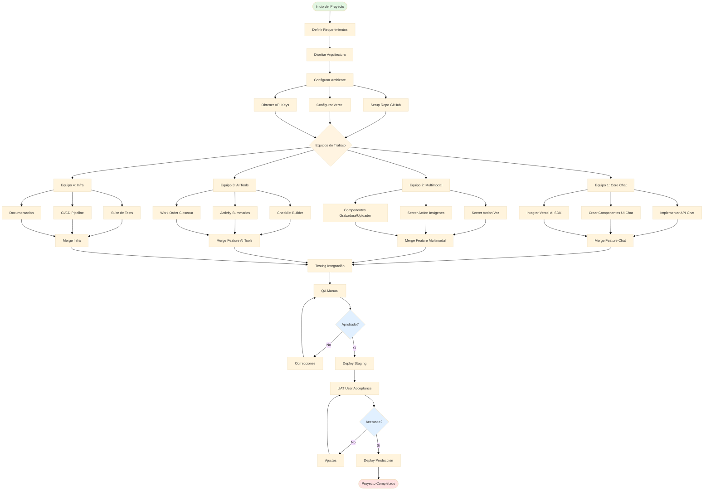

# WORKSHOP V1 - Descripciones Conceptuales

## Sistema GIMA (Gestión Integral de Mantenimiento y Activos)

**Universidad Nacional Experimental de Guayana (UNEG)**  
**Fecha:** Enero 2026  
**Versión:** 1.0

---

## 1. PLANTEAMIENTO DEL PROBLEMA

La Universidad Nacional Experimental de Guayana (UNEG) enfrenta desafíos significativos en la gestión de mantenimiento de sus instalaciones e infraestructura:

### 1.1 Problemática Identificada

- **Gestión Manual Ineficiente**: Los procesos de registro y seguimiento de órdenes de trabajo se realizan mediante sistemas fragmentados y documentación en papel
- **Falta de Trazabilidad**: No existe un sistema centralizado que permita rastrear el ciclo completo de mantenimiento de activos institucionales
- **Comunicación Deficiente**: La coordinación entre técnicos, supervisores y administradores carece de canales efectivos y trazables
- **Ausencia de Análisis Predictivo**: No se aprovechan datos históricos para prevenir fallas o planificar mantenimientos preventivos
- **Barreras de Acceso a Información**: El personal técnico requiere consultar manuales y especificaciones técnicas de manera rápida, lo cual actualmente consume tiempo valioso

### 1.2 Impacto en la Operación

- Incremento de tiempos de respuesta ante fallas
- Pérdida de información histórica de mantenimientos
- Dificultad en la planificación de recursos y presupuestos
- Imposibilidad de generar métricas confiables sobre desempeño del área de mantenimiento

---

## 2. JUSTIFICACIÓN

### 2.1 Necesidad Estratégica

La implementación de un **Sistema de Gestión Integral de Mantenimiento y Activos (GIMA)** potenciado con Inteligencia Artificial responde a:

1. **Modernización Institucional**: Alineación con estándares universitarios de gestión tecnológica del siglo XXI
2. **Optimización de Recursos**: Reducción de costos operativos mediante mantenimiento preventivo y predictivo
3. **Mejora en la Experiencia del Usuario**: Facilitación del trabajo técnico mediante asistencia inteligente
4. **Trazabilidad y Transparencia**: Cumplimiento de requisitos administrativos y de auditoría
5. **Capacidad de Análisis**: Generación de insights basados en datos para toma de decisiones

### 2.2 Ventajas de la Solución Propuesta

**Chatbot Multimodal con IA:**

- Consultas en lenguaje natural sobre procedimientos de mantenimiento
- Análisis de imágenes para identificación de piezas y diagnóstico
- Transcripción de voz para creación rápida de reportes
- Disponibilidad 24/7 como asistente técnico virtual

**Integración Tecnológica:**

- Uso de modelos de IA de última generación (GROQ Llama 3.3, Google Gemini)
- Arquitectura basada en web accessible desde cualquier dispositivo
- Stack tecnológico moderno y escalable (Next.js, React 19, TypeScript)

---

## 3. ALCANCE

### 3.1 Alcance del Primer Workshop (WS1)

**Fase Conceptual y de Planificación:**

- ✅ Definición completa del problema y justificación
- ✅ Identificación de objetivos generales y específicos
- ✅ Documentación del marco teórico y estado del arte
- ✅ Descripción conceptual de entidades, procesos y subprocesos
- ✅ Definición de la estructura organizacional del equipo
- ✅ Elaboración de diagrama de actividades (distribución de tareas)

**Fuera de Alcance (WS1):**

- Implementación de código
- Diseño de base de datos
- Despliegue en producción
- Integraciones con sistemas legacy

### 3.2 Alcance Proyectado del Segundo Workshop (WS2)

**Fase de Diseño Arquitectónico y Prototipado:**

- Diseño detallado de arquitectura del sistema
- Modelado de base de datos
- Definición de APIs y contratos de servicios
- Creación de prototipos de interfaz de usuario
- Plan de implementación técnica

---

## 4. OBJETIVO GENERAL

Diseñar conceptualmente un **Sistema Integral de Gestión de Mantenimiento y Activos (GIMA)** potenciado con Inteligencia Artificial, que optimice los procesos de mantenimiento preventivo, correctivo y predictivo de la Universidad Nacional Experimental de Guayana, mediante la integración de capacidades multimodales (texto, voz e imágenes) en una plataforma web moderna y escalable.

---

## 5. OBJETIVOS ESPECÍFICOS

1. **Conceptualizar la arquitectura del chatbot multimodal** para asistencia en gestión de mantenimiento
   - Definir capacidades conversacionales en lenguaje natural
   - Especificar funcionalidades de visión computacional para análisis de piezas
   - Diseñar mecanismos de transcripción de voz para generación de reportes

2. **Modelar los procesos de negocio** relacionados con la gestión de mantenimiento
   - Identificar y documentar el flujo de órdenes de trabajo
   - Mapear procesos de mantenimiento preventivo y correctivo
   - Definir ciclo de vida de los activos institucionales

3. **Establecer el marco teórico y tecnológico** del sistema
   - Investigar estado del arte en sistemas CMMS (Computerized Maintenance Management System)
   - Seleccionar y justificar stack tecnológico (Next.js, React, IA)
   - Documentar mejores prácticas de arquitectura SaaS

4. **Definir la estructura organizacional** para el desarrollo del proyecto
   - Conformar equipos de trabajo con roles claros
   - Asignar responsabilidades por componentes del sistema
   - Establecer metodología de trabajo colaborativo

5. **Crear un diagrama de actividades detallado** que refleje la distribución de tareas
   - Utilizar metodología PERT o equivalente
   - Asignar tareas específicas a cada miembro del equipo
   - Definir dependencias y secuencia de actividades

---

## 6. MARCO TEÓRICO

### 6.1 Sistemas de Gestión de Mantenimiento (CMMS)

Un **CMMS** (Computerized Maintenance Management System) es una aplicación de software que centraliza información de mantenimiento y facilita la gestión de procesos mediante:

- **Gestión de Órdenes de Trabajo**: Creación, asignación, seguimiento y cierre
- **Gestión de Activos**: Inventario detallado con historial de mantenimientos
- **Mantenimiento Preventivo**: Programación automática basada en calendarios o uso
- **Gestión de Inventario**: Control de repuestos y materiales
- **Reportes y Análisis**: Métricas de desempeño y KPIs del área de mantenimiento

### 6.2 Inteligencia Artificial en Mantenimiento

**IA Conversacional (Chatbots):**

- Procesamiento de Lenguaje Natural (NLP) para consultas de usuarios
- Generación de respuestas contextuales basadas en know ledge base
- Asistencia en resolución de problemas técnicos mediante diálogo guiado

**Visión Computacional:**

- Identificación automática de piezas y componentes mediante análisis de imágenes
- Detección de anomalías visuales (corrosión, desgaste, roturas)
- Extracción de información de placas y etiquetas (OCR)

**Análisis Predictivo:**

- Predicción de fallas basada en patrones históricos
- Optimización de calendarios de mantenimiento preventivo
- Estimación de vida útil de componentes

### 6.3 Arquitectura de Aplicaciones Web Modernas

**Arquitectura basada en Componentes:**

- Separación clara entre frontend (UI) y backend (API)
- Componentes reutilizables siguendo principios de atomic design
- Estado centralizado con gestión reactiva

**Next.js y React 19:**

- **Next.js**: Framework full-stack basado en React con renderizado híbrido (SSR/SSG/CSR)
- **React 19**: Biblioteca para construcción de interfaces de usuario con Server Components
- **App Router**: Sistema de enrutamiento basado en archivos con soporte para layouts anidados

**TypeScript:**

- Tipado estático que previene errores en tiempo de compilación
- Autocompletado inteligente en IDEs
- Mejor mantenibilidad y documentación del código

### 6.4 Modelos de IA Utilizados

**GROQ Llama 3.3 70B:**

- Modelo de lenguaje grande (LLM) optimizado para bajas latencias
- 70 mil millones de parámetros
- Especializado en tareas de razonamiento y generación de texto
- Context window: 128k tokens

**Google Gemini 2.5 Flash:**

- Modelo multimodal (texto, imágenes, audio)
- Optimizado para velocidad y eficiencia
- Capacidades de visión avanzadas para análisis de imágenes
- Soporte nativo para transcripción de audio

---

## 7. MARCO DE REFERENCIA (Estado del Arte)

### 7.1 Sistemas CMMS Comerciales

**Análisis Comparativo:**

| Sistema                    | Fortalezas                            | Debilidades                                  |
| -------------------------- | ------------------------------------- | -------------------------------------------- |
| **Maximo (IBM)**           | Robusto, escalable, módulos completos | Alto costo, curva de aprendizaje pronunciada |
| **Maintenance Connection** | Interfaz intuitiva, cloud-native      | Funcionalidades limitadas en plan base       |
| **Fiix (Rockwell)**        | Móvil-first, IoT integrado            | Requiere suscripción anual costosa           |
| **eMaint (Fluke)**         | Buena relación costo-beneficio        | Personalización limitada                     |

**Conclusión:** Los sistemas comerciales son costosos y genéricos, no adaptados a las necesidades específicas de instituciones educativas venezolanas.

### 7.2 Soluciones Open Source

**Análisis de Alternativas:**

- **Odoo (módulo de Mantenimiento)**: Completo pero complejo de configurar
- **Snipe-IT**: Enfocado en inventario de IT, no en mantenimiento industrial
- **MainWP**: Gestión de sitios WordPress, no aplicable

**Limitación Identificada:** No existe una solución open-source que combine CMMS con IA conversacional multimodal.

### 7.3 Tendencias en IA para Mantenimiento (2024-2026)

**Gemini for Maintenance (Google Cloud):**

- Asistentes de IA especializados para industrias
- Integración con sensores IoT para monitoreo predictivo

**GitHub Copilot for Operations:**

- Asistencia mediante IA en generación de procedimientos
- Automatización de documentación técnica

**ChatGPT Enterprise (OpenAI):**

- Chatbots personalizados con knowledge bases propietarias
- Alto costo y restricciones de privacidad de datos

### 7.4 Diferenciadores de la Solución GIMA

1. **Multimodalidad Integral**: Combina texto, voz e imágenes en una sola interfaz
2. **Código Abierto y Personalizable**: Desarrollado internamente, adaptable a necesidades UNEG
3. **Bajo Costo Operativo**: Uso de modelos de IA gratuitos (GROQ) o de bajo costo (Gemini)
4. **Enfoque Educativo**: Diseñado como proyecto formativo que genera capacidades internas

---

## 8. ESTRUCTURA DEL SALÓN Y EQUIPOS DE TRABAJO

### 8.1 Organización del Desarrollo

**Modelo de Trabajo:** Feature-Based Teams (Equipos por Funcionalidad)

### 8.2 Equipos y Roles

#### **Equipo 1: Core Chat & IA**

**Responsable:** Funcionalidades centrales del chatbot

| Rol                | Responsabilidad                                     | Miembros   |
| ------------------ | --------------------------------------------------- | ---------- |
| Tech Lead          | Arquitectura de IA y configuración de modelos       | 1 persona  |
| Backend Developer  | API routes, Server Actions, integración GROQ/Gemini | 2 personas |
| Frontend Developer | Componentes de chat, UI conversacional              | 2 personas |

**Entregables:**

- Endpoint `/api/chat` con streaming
- Componentes `chat.tsx`, `chat-message.tsx`, `chat-input.tsx`
- Integración con Vercel AI SDK

#### **Equipo 2: Funcionalidades Multimodales**

**Responsable:** Voz e imágenes

| Rol                  | Responsabilidad                                        | Miembros   |
| -------------------- | ------------------------------------------------------ | ---------- |
| AI Specialist        | Transcripción de voz y análisis de imágenes            | 1 persona  |
| Full-Stack Developer | Server Actions (`transcribeAudio`, `analyzePartImage`) | 2 personas |
| UX Developer         | Componentes de captura de voz/imagen                   | 1 persona  |

**Entregables:**

- Server Actions `app/actions/voice.ts`, `app/actions/vision.ts`
  -Components `voice-recorder.tsx`, `image-uploader.tsx`
- Prompts optimizados para cada modalidad

#### **Equipo 3: AI Tools**

**Responsable:** Herramientas impulsadas por IA

| Rol                | Responsabilidad                                          | Miembros   |
| ------------------ | -------------------------------------------------------- | ---------- |
| Product Owner      | Definición de features de AI Tools                       | 1 persona  |
| Frontend Developer | Páginas `/tools/*`                                       | 2 personas |
| AI Engineer        | Servicios de generación (Checklist, Summaries, Closeout) | 1 persona  |

**Entregables:**

- Checklist Builder (`/tools/checklist-builder`)
- Activity Summaries (`/tools/activity-summaries`)
- Work Order Closeout (modal component)
- Componentes AI compartidos

#### **Equipo 4: Infraestructura & DevOps**

**Responsable:** Calidad, testing y deployment

| Rol                | Responsabilidad                     | Miembros  |
| ------------------ | ----------------------------------- | --------- |
| DevOps Engineer    | CI/CD, Vercel deployment            | 1 persona |
| QA Engineer        | Testing (Vitest), validación E2E    | 1 persona |
| Documentation Lead | Documentación técnica y user guides | 1 persona |

**Entregables:**

- Suite de tests (`tests/`)
- Pipeline CI/CD con GitHub Actions
- Documentación completa (`docs/`)
- Ambiente de staging y production

### 8.3 Estructura Organizacional

```
└── Proyecto GIMA
    ├── Coordinador General (1)
    │   └── Coordina entre equipos y stakeholders
    │
    ├── Equipo 1: Core Chat & IA (5)
    ├── Equipo 2: Multimodal (4)
    ├── Equipo 3: AI Tools (4)
    └── Equipo 4: Infra & DevOps (3)

Total: 17 personas (incluye coordinador)
```

### 8.4 Metodología de Trabajo

**Framework:** Scrum Adaptado (Sprints semanales)

**Ceremonias:**

- Daily Standup (15 min, diario)
- Sprint Planning (lunes, 1 hora)
- Sprint Review (viernes, 1 hora)
- Sprint Retrospective (viernes, 30 min)

**Herramientas de Colaboración:**

- GitHub para código y revisiones (Pull Requests)
- GitHub Projects para tracking de tareas
- Discord/Slack para comunicación asíncrona
- Meet/Zoom para reuniones sincrónicas

---

## 9. DESCRIPCIONES CONCEPTUALES

### 9.1 Entidades del Sistema

#### 9.1.1 Usuario (User)

**Descripción:** Persona que interactúa con el sistema GIMA.

**Atributos:**

- ID único
- Nombre completo
- Rol (Admin, Supervisor, Técnico, Consultor)
- Correo electrónico
- Permisos y privilegios

**Relaciones:**

- Crea órdenes de trabajo
- Puede ser asignado a órdenes (técnicos)
- Gestiona activos (administradores)

#### 9.1.2 Activo (Asset)

**Descripción:** Equipo, maquinaria o instalación que requiere mantenimiento.

**Atributos:**

- ID único
- Nombre/descripción
- Tipo (UMA, BCA, TAB, ST - ver terminología UNEG)
- Ubicación (edificio, sector, piso)
- Fecha de adquisición
- Estado (operativo, fuera de servicio, en mantenimiento)
- Historial de mantenimientos

**Relaciones:**

- Asociado a múltiples órdenes de trabajo
- Pertenece a una categoría
- Tiene piezas/componentes

#### 9.1.3 Orden de Trabajo (Work Order)

**Descripción:** Solicitud o registro de actividad de mantenimiento.

**Atributos:**

- ID único
- Título
- Descripción del problema
- Activo asociado
- Tipo (preventivo, correctivo, predictivo, inspección)
- Prioridad (baja, media, alta, urgente)
- Estado (pendiente, en progreso, completada, cancelada)
- Técnico asignado
- Fecha de creación
- Fecha de vencimiento
- Fecha de completación
- Notas de cierre

**Relaciones:**

- Asociada a un activo
- Asignada a un técnico
- Puede tener múltiples tareas
- Registra materiales utilizados

#### 9.1.4 Mensaje del Chat (Chat Message)

**Descripción:** Interacción del usuario con el chatbot.

**Atributos:**

- ID único
- ID de conversación
- Rol (user, assistant, system)
- Contenido (texto)
- Parts (fragmentos multimodales: texto, imagen)
- Timestamp de creación
- Metadata (modelo usado, tokens consumidos)

**Relaciones:**

- Pertenece a una conversación
- Puede hacer referencia a órdenes de trabajo o activos

#### 9.1.5 Checklist Generado

**Descripción:** Lista de verificación creada por IA para mantenimiento.

**Atributos:**

- ID único
- ID de usuario creador
- Tipo de activo
- Tipo de mantenimiento
- Items del checklist (array de objetos)
- Instrucciones personalizadas
- Fecha de generación
- Estado (borrador, aceptado, aplicado)

**Relaciones:**

- Creado por usuario
- Puede ser vinculado a orden de trabajo

### 9.2 Procesos del Sistema

#### 9.2.1 Proceso: Gestión de Conversaciones con Chatbot

**Descripción:** Interacción natural del usuario con el asistente de IA.

**Pasos:**

1. Usuario abre la aplicación web
2. Se carga historial de conversación desde `localStorage`
3. Usuario escribe mensaje de texto, sube imagen, o usa voz
4. Frontend envía request a `/api/chat`
5. Backend procesa request:
   - Sanitiza mensajes
   - Determina modalidad (solo texto vs multimodal)
   - Selecciona modelo IA apropiado (GROQ o Gemini)
   - Ejecuta streaming de respuesta
6. Frontend recibe chunks y los renderiza en tiempo real
7. Mensaje completo se guarda en `localStorage`
8. Conversación actualizada se muestra al usuario

**Actores:**

- Usuario (humano)
- Chatbot Frontend (React component)
- API Route `/api/chat` (Next.js)
- Servicio de IA (GROQ/Gemini)

**Entradas:**

- Mensaje de usuario (texto/voz/imagen)
- Historial de conversación

**Salidas:**

- Respuesta generada por IA
- Conversación actualizada

#### 9.2.2 Proceso: Creación de Orden de Trabajo vía Voz

**Descripción:** Generación de orden de trabajo mediante comando de voz.

**Pasos:**

1. Usuario pulsa botón de "comando de voz para órdenes de trabajo"
2. Navegador solicita permiso de micrófono
3. Usuario dicta comando (ej: "Crear orden urgente para UMA sector 3")
4. Audio se captura como blob
5. Frontend convierte blob a base64
6. Se invoca Server Action `transcribeAudio(base64Audio)`
7. Backend envía audio a Gemini para transcripción con prompt especializado
8. IA retorna texto transcrito
9. Frontend parsea texto para extraer:
   - Acción (crear, consultar, asignar)
   - Prioridad (urgente, alta, media, baja)
   - Activo (UMA, BCA, TAB, ST)
   - Ubicación (sector 3)
10. Se muestra preview del comando interpretado
11. Usuario confirma o reintenta
12. Si confirma, se crea pre-filled orden de trabajo

**Actores:**

- Usuario (técnico/supervisor)
- Voice Recorder Component
- Server Action `transcribeAudio`
- Google Gemini API
- Orden de Trabajo (entidad a crear)

**Entradas:**

- Audio grabado (blob)
- Prompt de contexto UNEG

**Salidas:**

- Texto transcrito
- Orden de trabajo pre-filled

#### 9.2.3 Proceso: Análisis de Pieza por Imagen

**Descripción:** Identificación y catalogación de piezas mediante visión computacional.

**Pasos:**

1. Usuario sube imagen de pieza (cámara o galería)
2. Frontend valida formato y tamaño
3. Imagen se convierte a base64
4. Se invoca Server Action `analyzePartImage(base64Image, mimeType)`
5. Backend envía imagen a Gemini Vision con prompt de inventario
6. IA analiza y retorna:
   - Tipo de pieza
   - Marca visible
   - Estado (nuevo, desgaste, dañado)
   - Dimensiones estimadas (si aplicable)
   - Recomendaciones
7. Resultado se muestra formateado al usuario
8. Usuario puede guardar análisis en inventario

**Actores:**

- Usuario (técnico de inventario)
- Image Uploader Component
- Server Action `analyzePartImage`
- Google Gemini Vision API
- Sistema de Inventario (futuro)

**Entradas:**

- Imagen de pieza
- Prompt especializado en inventario industrial

**Salidas:**

- Análisis detallado de la pieza
- Sugerencias de catalogación

### 9.3 Subprocesos

#### 9.3.1 Subproceso: Sanitización de Mensajes

**Parte de:** Proceso de Gestión de Conversaciones  
**Responsable:** Utilidad `sanitizeMessages()`

**Pasos:**

1. Recibir array de mensajes raw
2. Para cada mensaje:
   - Validar estructura con esquema Zod
   - Convertir `createdAt` string a Date
   - Normalizar campo `content`
   - Validar que `role` sea válido
3. Filtrar mensajes vacíos o inválidos
4. Retornar array sanitizado

**Entrada:** `Message[]` (raw)  
**Salida:** `SanitizedMessage[]`

#### 9.3.2 Subproceso: Streaming de Respuesta IA

**Parte de:** Proceso de Gestión de Conversaciones  
**Responsable:** API Route `/api/chat`

**Pasos:**

1. Crear stream con `streamText()` de Vercel AI SDK
2. Configurar modelo (GROQ Llama o Gemini)
3. Pasar mensajes sanitizados como historial
4. Por cada chunk recibido:
   - Emitir evento SSE al frontend
   - Formato: `data: {"type":"text-delta","textDelta":"..."}`
5. Al finalizar, emitir `data: [DONE]`
6. Cerrar stream

**Entrada:** Mensajes sanitizados, modelo seleccionado  
**Salida:** Server-Sent Events stream

#### 9.3.3 Subproceso: Generación de Checklist con IA

**Parte de:** AI Tools - Checklist Builder  
**Responsable:** Service `ChecklistAIService`

**Pasos:**

1. Recibir parámetros (assetType, taskType, instrucciones)
2. Construir prompt structurado con:
   - Contexto del activo y tipo de mantenimiento
   - Instrucciones personalizadas del usuario
   - Formato de salida esperado (JSON schema)
3. Invocar GROQ con `generateObject()`
4. Validar output con esquema Zod
5. Si falla, reintentar hasta 3 veces
6. Cachear resultado (1 hora TTL)
7. Return resultado o error

**Entrada:** `{ assetType, taskType, instructions }`  
**Salida:** `{ items: ChecklistItem[], metadata }`

### 9.4 Actividades

#### 9.4.1 Actividad: Configurar Variables de Entorno

**Responsable:** Equipo Infra & DevOps  
**Duración:** 1 hora

**Pasos:**

1. Crear cuenta en GROQ Console
2. Generar API key de GROQ
3. Crear cuenta en Google AI Studio
4. Generar API key de Gemini
5. Copiar `.env.example` a `.env.local`
6. Pegar API keys en archivo `.env.local`
7. Verificar con `npm run dev`

#### 9.4.2 Actividad: Implementar Componente de Chat

**Responsable:** Equipo Core Chat & IA  
**Duración:** 2 días

**Pasos:**

1. Crear estructura de archivos:
   - `components/features/chat/chat.tsx`
   - `components/features/chat/chat-header.tsx`
   - `components/features/chat/chat-message.tsx`
   - `components/features/chat/chat-input.tsx`
2. Implementar estado local con `useChat` de Vercel AI SDK
3. Diseñar UI siguiendo Figma mockups
4. Conectar con API `/api/chat`
5. Implementar persistencia con `localStorage`
6. Añadir loading states y error handling
7. Testing manual
8. Code review y merge

#### 9.4.3 Actividad: Documentar API Endpoints

**Responsable:** Equipo Infra & DevOps  
**Duración:** 4 horas

**Pasos:**

1. Crear `docs/API.md`
2. Para cada endpoint documentar:
   - Path y método HTTP
   - Headers requeridos
   - Body schema (con ejemplos)
   - Response format
   - Códigos de estado
   - Ejemplos de uso con curl y JavaScript
3. Review con tech leads
4. Publicar en wiki del proyecto

### 9.5 Tareas

#### 9.5.1 Tarea: Escribir Tests para `sanitizeMessages()`

**Responsable:** QA Engineer (Equipo Infra)  
**Duración:** 2 horas  
**Prioridad:** Media

**Descripción:**
Crear suite de tests unitarios para la función `sanitizeMessages()` ubicada en `app/utils/sanitize-messages.ts`.

**Casos de Prueba:**

1. Mensajes válidos se mantienen intactos
2. Mensajes con `createdAt` string se convierten a Date
3. Mensajes vacíos se filtran
4. Mensajes con `role` inválido se rechazan
5. Arrays vacíos retornan arrays vacíos

**Archivo:** `tests/unit/utils/sanitize-messages.test.ts`

#### 9.5.2 Tarea: Optimizar Prompts de IA

**Responsable:** AI Specialist (Equipo Multimodal)  
**Duración:** 3 horas  
**Prioridad:** Alta

**Descripción:**
Revisar y mejorar los prompts usados en:

- `VOICE_PROMPT` (transcripción de voz)
- `INVENTORY_PROMPT` (análisis de imágenes)
- `CHECKLIST_PROMPT` (generación de checklists)

**Objetivos:**

- Reducir ambigüedad en las respuestas
- Mejorar formato de salida (JSON válido)
- Incluir ejemplos one-shot o few-shot
- Testear con casos edge

**Archivo:** `app/config/prompts.ts`

#### 9.5.3 Tarea: Configurar ESLint Rules Personalizadas

**Responsable:** Tech Lead (Equipo Core)  
**Duración:** 1 hora  
**Prioridad:** Media

**Descripción:**
Añadir reglas custom de ESLint al archivo `eslint.config.mjs` para enforcer convenciones del proyecto.

**Reglas a Añadir:**

- Prohibir `any` explícito (warn)
- Enforcer nombres de archivos en kebab-case
- Máximo 200 líneas por archivo
- Require JSDoc en funciones exportadas

**Validar:** Ejecutar `npm run lint` sin errores

---

## 10. DIAGRAMA DE ACTIVIDADES (PERT)

### 10.1 Visualización Mermaid



### 10.2 Matriz de Responsabilidades (RACI)

| Actividad                 | Equipo 1 Core | Equipo 2 Multi | Equipo 3 Tools | Equipo 4 Infra | Coordinador |
| ------------------------- | ------------- | -------------- | -------------- | -------------- | ----------- |
| Definir requerimientos    | C             | C              | C              | C              | **R/A**     |
| Diseñar arquitectura      | **R**         | C              | C              | C              | **A**       |
| Setup ambiente            | I             | I              | I              | **R/A**        | I           |
| Implementar API Chat      | **R/A**       | I              | I              | C              | I           |
| Server Actions Multimodal | I             | **R/A**        | I              | C              | I           |
| AI Tools Features         | I             | I              | **R/A**        | C              | I           |
| Testing & QA              | C             | C              | C              | **R/A**        | I           |
| Documentación             | C             | C              | C              | **R/A**        | **A**       |
| Deploy Staging/Prod       | I             | I              | I              | **R**          | **A**       |

**Leyenda RACI:**

- **R**: Responsible (Ejecuta la tarea)
- **A**: Accountable (Aprueba/Responsable final)
- **C**: Consulted (Consultado)
- **I** : Informed (Informado)

### 10.3 Distribución de Tareas por Miembro

**Ejemplo de Asignación (17 miembros):**

| #   | Nombre      | Equipo     | Rol           | Tareas Principales                 |
| --- | ----------- | ---------- | ------------- | ---------------------------------- |
| 1   | Coordinador | -          | PM            | Gestión del proyecto, stakeholders |
| 2   | Dev 1       | Core       | Tech Lead     | Arquitectura IA, config modelos    |
| 3   | Dev 2       | Core       | Backend       | API `/api/chat`, streaming         |
| 4   | Dev 3       | Core       | Backend       | Server Actions, utils              |
| 5   | Dev 4       | Core       | Frontend      | Componentes chat UI                |
| 6   | Dev 5       | Core       | Frontend      | Hooks personalizados, estado       |
| 7   | Dev 6       | Multimodal | AI Specialist | Prompts IA, optimizaciones         |
| 8   | Dev 7       | Multimodal | Full-Stack    | `transcribeAudio()`, voice UI      |
| 9   | Dev 8       | Multimodal | Full-Stack    | `analyzePartImage()`, image UI     |
| 10  | Dev 9       | Multimodal | UX Dev        | Componentes grabadora/uploader     |
| 11  | Dev 10      | Tools      | PO            | Definición de AI Tools features    |
| 12  | Dev 11      | Tools      | Frontend      | Checklist Builder page             |
| 13  | Dev 12      | Tools      | Frontend      | Activity Summaries, Closeout       |
| 14  | Dev 13      | Tools      | AI Engineer   | Services de generación IA          |
| 15  | Dev 14      | Infra      | DevOps        | CI/CD, Vercel config               |
| 16  | Dev 15      | Infra      | QA            | Testing Vitest, E2E                |
| 17  | Dev 16      | Infra      | Docs Lead     | Documentación técnica              |

---

## 11. CONCLUSIONES

### 11.1 Resumen del Workshop V1

En este primer workshop se ha logrado:

✅ **Clarificación del problema**: Identificación precisa de deficiencias en gestión de mantenimiento UNEG  
✅ **Justificación sólida**: Argumentación técnica y estratégica de la solución propuesta  
✅ **Objetivos bien definidos**: Objetivo general y 5 objetivos específicos medibles  
✅ **Marco teórico robusto**: Fundamentación en CMMS, IA conversacional y arquitecturas modernas  
✅ **Estado del arte documentado**: Análisis comparativo de soluciones existentes  
✅ **Organización establecida**: 4 equipos con roles claros y responsabilidades asignadas  
✅ **Entidades y procesos modelados**: Descripción conceptual completa del sistema  
✅ **Diagrama de actividades**: Visualización PERT y matriz RACI para seguimiento

### 11.2 Próximos Pasos (WS2)

El segundo workshop abordará:

1. **Diseño Arquitectónico Detallado**
   - Diagramas de componentes
   - Diagramas de secuencia
   - Diagramas de deployment

2. **Modelado de Base de Datos**
   - Esquema relacional
   - Índices y optimizaciones
   - Estrategia de migrations

3. **Definición de APIs**
   - Contratos de servicios (OpenAPI)
   - Esquemas de validación (Zod)
   - Rate limiting y seguridad

4. **Prototipos de UI**
   - Wireframes de pantallas principales
   - Sistema de diseño (tokens, componentes)
   - Flujos de usuario

5. **Plan de Implementación Técnica**
   - Roadmap de sprints
   - Criterios de aceptación
   - Estrategia de testing

---

## ANEXOS

### A. Glosario de Términos UNEG

| Término | Descripción                              |
| ------- | ---------------------------------------- |
| **UMA** | Unidad Manejadora de Aire - Sistema HVAC |
| **BCA** | Bomba Centrífuga de Agua                 |
| **TAB** | Tablero de Distribución Eléctrica        |
| **ST**  | Subestación Transformadora               |

### B. Stack Tecnológico Completo

**Frontend:**

- Next.js 16.0 (App Router)
- React 19.2
- TypeScript 5
- Tailwind CSS 4
- Radix UI (componentes primitivos)

**IA & ML:**

- Vercel AI SDK 5.0
- GROQ (Llama 3.3 70B)
- Google Gemini 2.5 Flash
- Zod (validación de schemas)

**Dev Tools:**

- Vitest (testing)
- ESLint 9 + Prettier
- Husky (git hooks)
- GitHub Actions (CI/CD)

**Deployment:**

- Vercel (hosting)
- Edge Functions
- Serverless Architecture

### C. Referencias Bibliográficas

1. **IBM Maximo Documentation** - CMMS Industry Standards
2. **Google AI Documentation** - Gemini API Best Practices
3. **Vercel AI SDK Docs** - Streaming and Multi-modal AI
4. **Next.js Documentation** - App Router Architecture
5. **React 19 Release Notes** - Server Components

---

**Documento elaborado por:** Equipo GIMA  
**Fecha:** Enero 2026  
**Versión:** 1.0  
**Repositorio:** [github.com/proyecto-gima](https://github.com)
